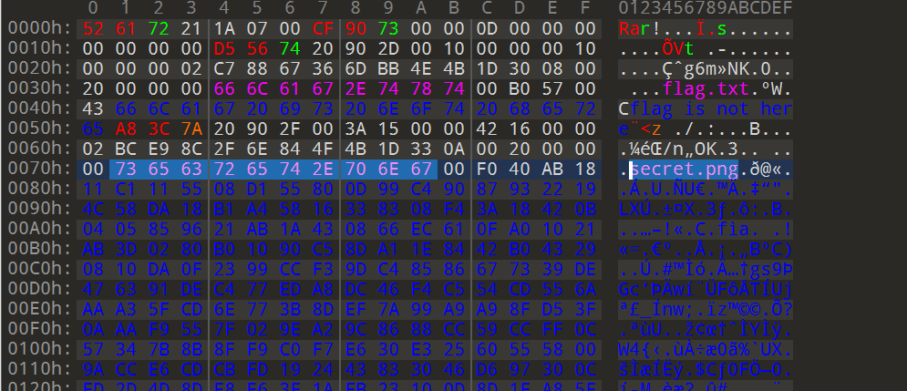

## Misc

### 1. this_is_flag

直接提交

### 2. pdf

打开CTRL F搜索flag即可，做了文字隐藏

### 3. 如来十三掌

与佛论禅解密 [与佛论禅密码 - Bugku CTF](https://ctf.bugku.com/tool/todousharp)；

ROT13 解密；

Base64解密；

### 4. give_you_flag

Stegsolve抽取展示二维码的那一帧，把四个角补全，用QR Research扫描即可得到flag


### 5. 坚持60s

jd-gui打开看jar包源码，搜flag后base64解密；

### 6. gif

黑色代表0，白色代表1，二进制解码即可得到flag；

### 7. stegano

将pdf中所有的内容CTRL A拷贝出来有一行BA字符串A对应. B对于-，莫斯解密

### 8. 掀桌子

一般来说，我们使用的都是7位的ascii码，即0-127，而128-255则是扩展的一些其他符号，给的加密串很明显是128-255部分的。需要对其进行128取余操作后再解密。

```python
flag = ''
s='c8e9aca0c6f2e5f3e8c4efe7a1a0d4e8e5a0e6ece1e7a0e9f3baa0e8eafae3f9e4eafae2eae4e3eaebfaebe3f5e7e9f3e4e3e8eaf9eaf3e2e4e6f2'
l = len(s)//2
for i in range(l):
    flag += chr(int(s[i*2:(i+1)*2], 16) % 128)
print(flag, end='')

```

### 9. ext3

010打开搜flag关键字，发现存在flag.txt文件，此文件可以用7z解压，直接解压，flag.txt文件中是一串base64编码的字符串，解码即可得到flag

### 10. SimpleRAR

解压发现只有一个txt文件，里面还不是flag，遂用010打开，发现藏了一个png图片：




百度了一下rar每个块的开头：


我们要的是文件块而不是子块，于是更改7A为74，成功解压，发现是一张空白的png图片，010打开，文件头却是gif：


需要用photoshop或者gifsplitter来分离图层，分离图层后拼接两张图片是个二维码，扫描即得flag

### 11. Banmabanma

条形码扫描：

[Barcode Reader. Free Online Web Application (inliteresearch.com)](https://online-barcode-reader.inliteresearch.com/)

## Web

### 1. view_source

需要查看网页源代码，禁用了右键，CTRL U即可

### 2. robots

首先百度查看下robots协议：

[Robots协议详解-CSDN博客](https://blog.csdn.net/wallacer/article/details/654289?ops_request_misc=%7B%22request%5Fid%22%3A%22162968119416780265444488%22%2C%22scm%22%3A%2220140713.130102334..%22%7D&request_id=162968119416780265444488&biz_id=0&utm_medium=distribute.pc_search_result.none-task-blog-2~all~sobaiduend~default-1-654289.pc_search_similar&utm_term=robot协议&spm=1018.2226.3001.4187)

简单来说当robots访问一个网站（比如http://www.abc.com）时，首先会检查该网站中是否存在http://www.abc.com/robots.txt这个文件，如果机器人找到这个文件，它就会根据这个文件的内容，来确定它访问**权限**的范围（也就相当于一个管理权限的文件）；

url访问robots.txt：


访问f1ag_1s_h3re.php即可得到flag；

### 3. backup

访问直接提示：

```
你知道index.php的备份文件名吗？
```

凭经验是index.php.bak，直接访问即可得到源码，flag在其中（当然也可以dirsearch扫描）

### 4. cookie

burp抓包，cookie中提示要去cookie.php


访问，flag再response header中：


### 5. disabled_button

CTRL U查看源代码：

```html
<form action="" method="post" >
<input disabled class="btn btn-default" style="height:50px;width:200px;" type="submit" value="flag" name="auth" />
</form>
```


表单按钮是需要一个POST 参数auth=flag，hackbar发送即可得到flag。

### 6. get_post

没啥难度，照提示一步一步做即可，hackbar截图：


### 7. weak_auth

随便登录提示要以admin登录，burp抓包，Intruder爆破密码，爆破出来是123456，得到flag


使用的dict是：

```
D:\Global\apps\fuzzDicts\2021-12-11T08.19.00\passwordDict\top500.txt
```

### 8. simple_php

php代码审计：

```php
<?php
show_source(__FILE__);
include("config.php");
$a=@$_GET['a'];
$b=@$_GET['b'];
if($a==0 and $a){
    echo $flag1;
}
if(is_numeric($b)){
    exit();
}
if($b>1234){
    echo $flag2;
}
?>

```

运用到了php若相等，直接发请求即可得到flag


### 9. command_execution

命令执行，没有[GXYCTF2019]Ping Ping Ping （在buu的wp中）难，payload：

```
1;cat /home/flag.txt
```

### 10. Training-WWW-Robots

同 robots，访问robots.txt后访问flag页面即可

### 11. xff_referer

burp抓包按提示重新构造http 请求头即可：

```http
X-Forwarded-For: 123.123.123.123
referer: https://www.google.com
```

- X-Forward-For（xff）是客户端连接到网页的ip
- referer是客户从哪个网页来访问的当前页面。

### 12. baby_web